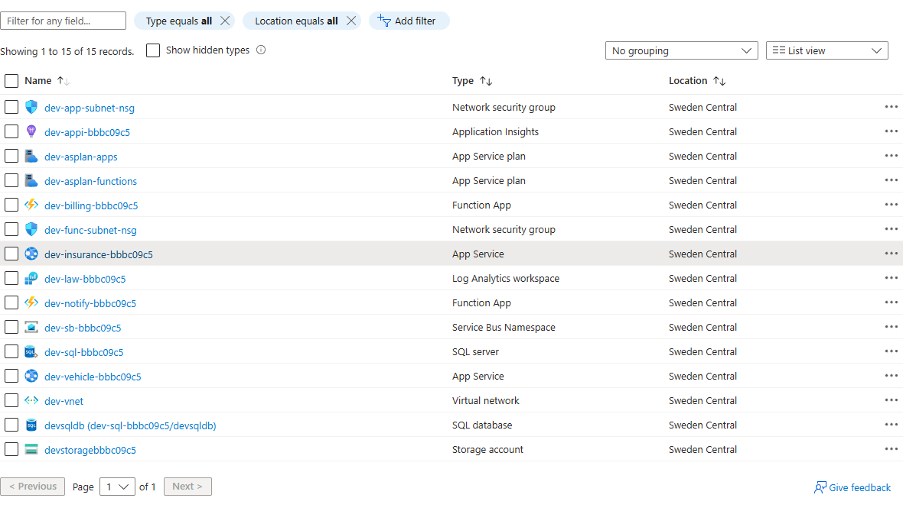
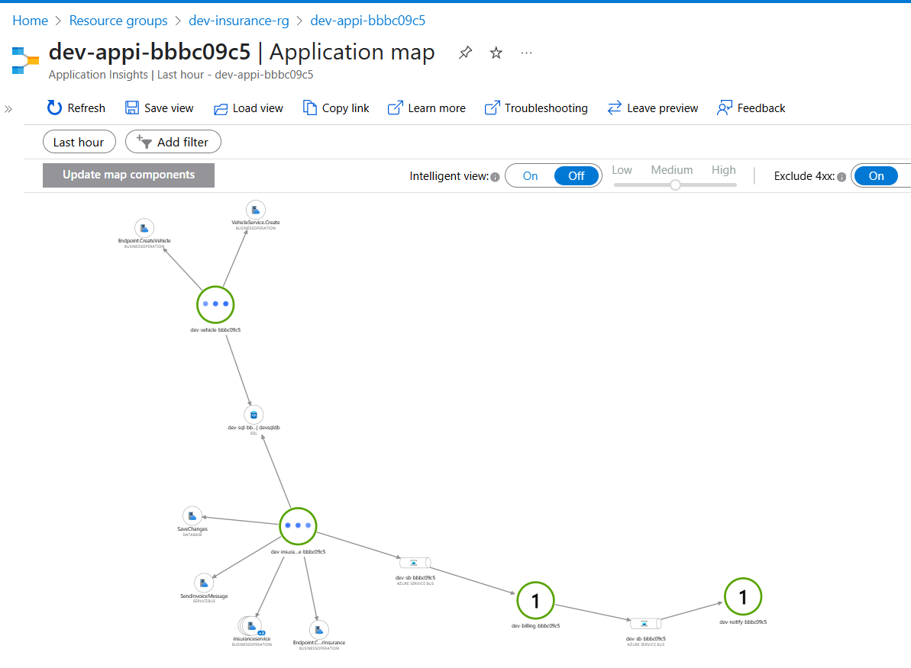

# Insurance Management System - End-to-End Deployment Guide

This document provides a comprehensive guide for deploying and testing the Insurance Management System from infrastructure setup to functional verification.

## 1. Infrastructure Deployment

First, we deploy the Azure infrastructure using the provided Bicep templates.

### Prerequisites

- Azure CLI installed and authenticated
- Appropriate Azure subscription permissions
- Bash shell environment

### Deployment Steps

```bash
cd infrastructure/
./deploy.sh
```

### Deployment Execution and Output

```bash
$ cd infrastructure/

$ ./deploy.sh
Enter environment/stage [dev]:
Enter resource group name [dev-insurance-rg]:
Enter Azure location [swedencentral]:
Enter SQL admin password [ComplexPass123!]:
{
"id": "/subscriptions/c3d0724e-c651-443f-9138-3cafb03c3b00/resourceGroups/dev-insurance-rg",
"location": "swedencentral",
"managedBy": null,
"name": "dev-insurance-rg",
"properties": {
"provisioningState": "Succeeded"
},
"tags": null,
"type": "Microsoft.Resources/resourceGroups"
}
Generated unique string: bbbc09c5
This will be used as suffix for all resource names

Resource Group: dev-insurance-rg
Location: swedencentral
Stage/Environment: dev
Unique String: bbbc09c5
SQL Admin Password: [HIDDEN]

=== Resource ===
Storage Account: devstoragebbbc09c5
SQL Server: dev-sql-bbbc09c5
SQL Database: devsqldb
Service Bus: dev-sb-bbbc09c5
App Insights: dev-appi-bbbc09c5
Log Analytics Workspace: dev-law-bbbc09c5
Insurance Management App: dev-insurance-bbbc09c5
Vehicle Insurance App: dev-vehicle-bbbc09c5
Billing Function: dev-billing-bbbc09c5
Notification Function: dev-notify-bbbc09c5

=== Static Resource ===
Virtual Network: dev-vnet
App Subnet: dev-app-subnet
Function Subnet: dev-func-subnet
App Service Plan (Web Apps): dev-asplan-apps
App Service Plan (Functions): dev-asplan-functions

=== Service URLs ===
Insurance Management: https://dev-insurance-bbbc09c5.azurewebsites.net
Vehicle Insurance: https://dev-vehicle-bbbc09c5.azurewebsites.net
Billing Function: https://dev-billing-bbbc09c5.azurewebsites.net
Notification Function: https://dev-notify-bbbc09c5.azurewebsites.net

Deploying infrastructure...

Deployment complete!
```

### Deployment Configuration Parameters

| Parameter          | Default Value      | Description                       |
| ------------------ | ------------------ | --------------------------------- |
| Environment/Stage  | `dev`              | Deployment environment identifier |
| Resource Group     | `dev-insurance-rg` | Target Azure resource group       |
| Azure Location     | `swedencentral`    | Azure region for deployment       |
| SQL Admin Password | `ComplexPass123!`  | SQL Server administrator password |

### Deployed Resources

#### Compute and Networking

- **Virtual Network**: `dev-vnet`
- **App Subnet**: `dev-app-subnet`
- **Function Subnet**: `dev-func-subnet`
- **App Service Plan (Web Apps)**: `dev-asplan-apps`
- **App Service Plan (Functions)**: `dev-asplan-functions`

#### Data and Storage

- **Storage Account**: `devstoragebbbc09c5`
- **SQL Server**: `dev-sql-bbbc09c5`
- **SQL Database**: `devsqldb`

#### Messaging and Monitoring

- **Service Bus**: `dev-sb-bbbc09c5`
- **Application Insights**: `dev-appi-bbbc09c5`
- **Log Analytics Workspace**: `dev-law-bbbc09c5`

#### Applications and Functions

- **Insurance Management App**: `dev-insurance-bbbc09c5`
- **Vehicle Insurance App**: `dev-vehicle-bbbc09c5`
- **Billing Function**: `dev-billing-bbbc09c5`
- **Notification Function**: `dev-notify-bbbc09c5`

### Service Endpoints

- **Insurance Management**: https://dev-insurance-bbbc09c5.azurewebsites.net
- **Vehicle Insurance**: https://dev-vehicle-bbbc09c5.azurewebsites.net
- **Billing Function**: https://dev-billing-bbbc09c5.azurewebsites.net
- **Notification Function**: https://dev-notify-bbbc09c5.azurewebsites.net

_Note: Unique string `bbbc09c5` is generated automatically to ensure resource name uniqueness._

## 2. Application Deployment

After successful infrastructure deployment, deploy the application services and functions.

### Deployment Command

```bash
./release.sh dev-insurance-rg dev
```

### Deployment Process

The release script performs the following operations:

1. **Parallel Deployment**: All services and functions are deployed simultaneously for efficiency
2. **Build Process**: Each component is built with optimized settings
3. **Service Registration**: Applications are registered with their respective Azure services
4. **Health Checks**: Deployment success is verified for each component

### Deployment Output Summary

```
🚀 Starting parallel deployment of all services and functions...

🔨 Building Insurance Management Service...
🔨 Building Vehicle Insurance Service...
🔨 Building Billing Service Function...
🔨 Building Notification Service Function...

🚀 Deploying Insurance Management Service...
🚀 Deploying Vehicle Insurance Service...
🚀 Deploying Billing Service Function...
🚀 Deploying Notification Service Function...

✅ Insurance Management Service deployed successfully!
✅ Vehicle Insurance Service deployed successfully!
✅ Billing Service Function deployed successfully!
✅ Notification Service Function deployed successfully!

🎉 All deployments completed successfully!
```

### Deployed Services

| Service              | Type           | URL                                              |
| -------------------- | -------------- | ------------------------------------------------ |
| Insurance Management | Web API        | https://dev-insurance-bbbc09c5.azurewebsites.net |
| Vehicle Insurance    | Web API        | https://dev-vehicle-bbbc09c5.azurewebsites.net   |
| Billing Service      | Azure Function | https://dev-billing-bbbc09c5.azurewebsites.net   |
| Notification Service | Azure Function | https://dev-notify-bbbc09c5.azurewebsites.net    |

## 3. Azure Resource Group Status

### Architecture Overview



### Azure Portal View



The infrastructure includes:

- **Resource Group**: `dev-insurance-rg` in Sweden Central region
- **Compute**: App Service Plans for web apps and Azure Functions
- **Storage**: Azure SQL Database and Storage Account
- **Networking**: Virtual Network with dedicated subnets
- **Messaging**: Service Bus for asynchronous communication
- **Monitoring**: Application Insights and Log Analytics

## 4. API Testing with HTTP Requests

This section demonstrates the system functionality through API testing using the `test.http` file.

### 4.1 Vehicle Registration

**Request**: Create a new vehicle in the system

**Response**: HTTP 201 Created

```json
{
  "licensePlate": "ABC5879",
  "make": "Honda",
  "model": "Accord",
  "year": 2017,
  "vin": "1HGCM82633A487962",
  "id": "9f42513c-de9c-40a5-bcd1-24661e130f40",
  "createdAt": "2025-06-16T09:31:17.7306874Z",
  "updatedAt": "2025-06-16T09:31:17.7307016Z",
  "isDeleted": false,
  "deletedAt": null
}
```

**Key Points**:

- Vehicle successfully registered with unique ID
- Audit fields (createdAt, updatedAt) automatically populated
- Soft delete functionality enabled (isDeleted: false)

### 4.2 Insurance Policy Creation

**Request**: Create insurance policy for the registered vehicle

**Response**: HTTP 201 Created

```json
{
  "id": "3335fcf3-1153-42d9-be53-952c47c0d693",
  "status": "Active",
  "startDate": "2025-06-16T09:31:49.613Z",
  "endDate": "2026-06-16T09:31:49.613Z",
  "renewalDate": "2026-06-16T09:31:49.613Z",
  "totalPremium": 150.0,
  "deductible": 0,
  "notes": "Charlie Brown insurance with both coverages",
  "vehicle": {
    "id": "9f42513c-de9c-40a5-bcd1-24661e130f40",
    "licensePlate": "ABC5879",
    "make": "Honda",
    "model": "Accord",
    "year": 2017,
    "vin": "1HGCM82633A487962"
  },
  "policy": {
    "id": "55555555-5555-5555-5555-555555555555",
    "name": "Standard Vehicle Policy",
    "policyType": "Vehicle",
    "description": "Standard policy for vehicle insurance.",
    "insuranceCompany": "if.se",
    "isActive": true,
    "coverages": [
      {
        "id": "33333333-3333-3333-3333-333333333333",
        "name": "Basic Vehicle Coverage",
        "tier": "Basic",
        "description": "Covers basic vehicle insurance requirements.",
        "price": 100.0,
        "durationInMonths": 12,
        "status": "Active"
      },
      {
        "id": "44444444-4444-4444-4444-444444444444",
        "name": "Complementary Vehicle Coverage",
        "tier": "Complementary",
        "description": "Covers additional vehicle insurance needs.",
        "price": 50.0,
        "durationInMonths": 12,
        "status": "Active"
      }
    ]
  },
  "selectedCoverages": [
    // Both Basic and Complementary coverages selected
  ],
  "invoices": []
}
```

**Key Features Demonstrated**:

- **Policy Association**: Vehicle linked to Standard Vehicle Policy
- **Multiple Coverages**: Both Basic ($100) and Complementary ($50) coverage selected
- **Total Premium**: $150 (sum of selected coverages)
- **Policy Duration**: 12-month policy with automatic renewal date
- **Invoice Generation**: Initially empty, will be populated by billing function

### 4.3 User Insurance Portfolio Retrieval

**Request**: Get all insurances for user by personal ID (U1003 - Charlie Brown)

**Response**: HTTP 200 OK

```json
{
  "user": {
    "id": "33333333-3333-3333-3333-333333333333",
    "personalId": "U1003",
    "name": "Charlie Brown",
    "email": "charlie@example.com",
    "phoneNumber": "5551234567",
    "address": "789 Oak St, Newcity",
    "status": "Active",
    "dateOfBirth": "1992-08-20T00:00:00"
  },
  "insurances": [
    {
      "id": "fca75676-d5d7-4689-994c-34b1ea26e32a",
      "status": "Active",
      "startDate": "2025-06-16T09:55:16.395",
      "endDate": "2026-06-16T09:55:16.395",
      "renewalDate": "2026-06-16T09:55:16.396",
      "totalPremium": 150.0,
      "deductible": 0.0,
      "notes": "Charlie Brown insurance with both coverages",
      "vehicle": {
        "id": "9bd936b6-0389-49ab-ab2c-b9b29df49b49",
        "licensePlate": "ABC7129",
        "make": "Honda",
        "model": "Accord",
        "year": 2018,
        "vin": "1HGCM82633A893550"
      },
      "invoices": [
        {
          "id": "7b9f100b-4b25-487d-98cc-78f7b6b1e1c6",
          "status": "Pending",
          "amount": 75.0,
          "paidAmount": 0.0,
          "issuedDate": "2025-06-16T09:55:16.8694024",
          "dueDate": "2025-07-16T09:55:16.8694024",
          "invoiceNumber": "INV-20250616-5BCB275E"
        }
      ]
    },
    {
      "id": "3335fcf3-1153-42d9-be53-952c47c0d693",
      "status": "Active",
      "startDate": "2025-06-16T09:31:49.613",
      "endDate": "2026-06-16T09:31:49.613",
      "renewalDate": "2026-06-16T09:31:49.613",
      "totalPremium": 150.0,
      "deductible": 0.0,
      "notes": "Charlie Brown insurance with both coverages",
      "vehicle": {
        "id": "9f42513c-de9c-40a5-bcd1-24661e130f40",
        "licensePlate": "ABC5879",
        "make": "Honda",
        "model": "Accord",
        "year": 2017,
        "vin": "1HGCM82633A487962"
      },
      "invoices": [
        {
          "id": "8eb43135-a7e7-42e3-a973-e98e0c7ba01c",
          "status": "Pending",
          "amount": 75.0,
          "paidAmount": 0.0,
          "issuedDate": "2025-06-16T09:32:03.4944052",
          "dueDate": "2025-07-16T09:32:03.4944052",
          "invoiceNumber": "INV-20250616-9563690A"
        }
      ]
    }
  ]
}
```

**System Behavior Analysis**:

1. **User Profile**: Complete user information retrieved including personal details and contact information
2. **Multiple Policies**: Charlie Brown has 2 active insurance policies for different vehicles
3. **Automatic Billing**: Both policies have generated invoices automatically via the billing function
4. **Invoice Details**:
   - Invoice amounts: $75.00 each (likely first installment of $150 premium)
   - Status: Pending payment
   - Due dates: 30 days from issue date
   - Unique invoice numbers with date-based format

**Business Logic Verification**:

- ✅ Vehicle registration working correctly
- ✅ Insurance policy creation functional
- ✅ User-policy association established
- ✅ Automatic invoice generation active
- ✅ Data persistence across multiple requests
- ✅ API endpoints responding with appropriate HTTP status codes

## 5. Application Monitoring

### Application Insights Dashboard



The monitoring setup provides:

- **Request Tracking**: API call volumes and response times
- **Dependency Monitoring**: Database and Service Bus interactions
- **Exception Logging**: Error tracking and diagnostics
- **Performance Metrics**: Application performance insights
- **Custom Telemetry**: Business-specific metrics and events

## 6. Deployment Summary

### ✅ Successful Deployment Verification

| Component             | Status      | Endpoint                                         | Notes                           |
| --------------------- | ----------- | ------------------------------------------------ | ------------------------------- |
| Infrastructure        | ✅ Deployed | N/A                                              | All Azure resources provisioned |
| Insurance Management  | ✅ Deployed | https://dev-insurance-bbbc09c5.azurewebsites.net | API responding                  |
| Vehicle Insurance     | ✅ Deployed | https://dev-vehicle-bbbc09c5.azurewebsites.net   | API responding                  |
| Billing Function      | ✅ Deployed | https://dev-billing-bbbc09c5.azurewebsites.net   | Auto-invoicing active           |
| Notification Function | ✅ Deployed | https://dev-notify-bbbc09c5.azurewebsites.net    | Email notifications ready       |
