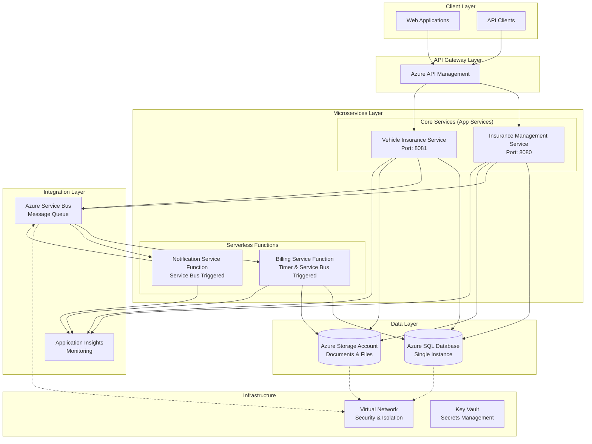
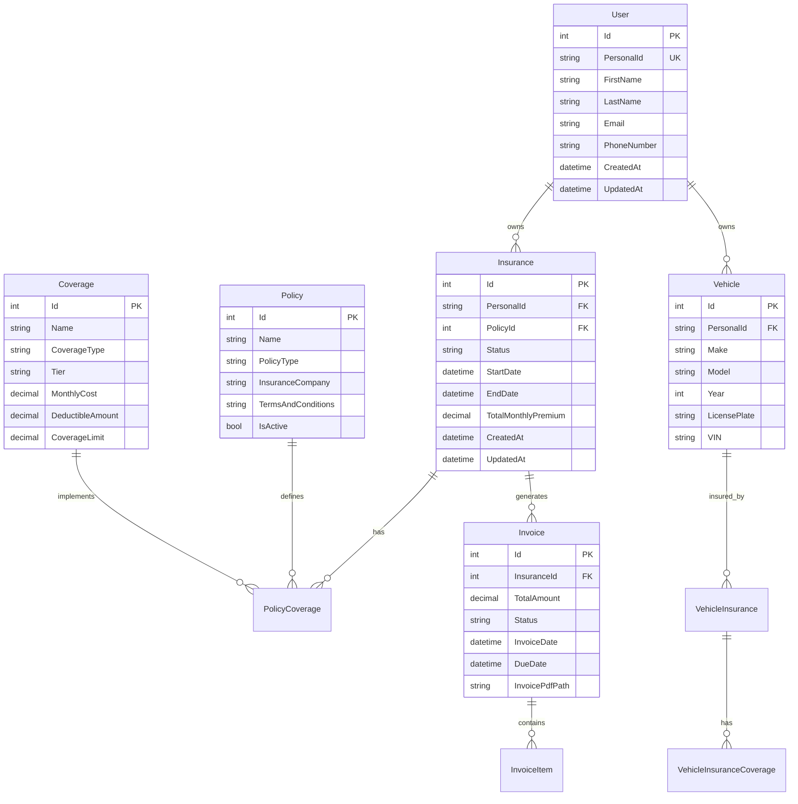
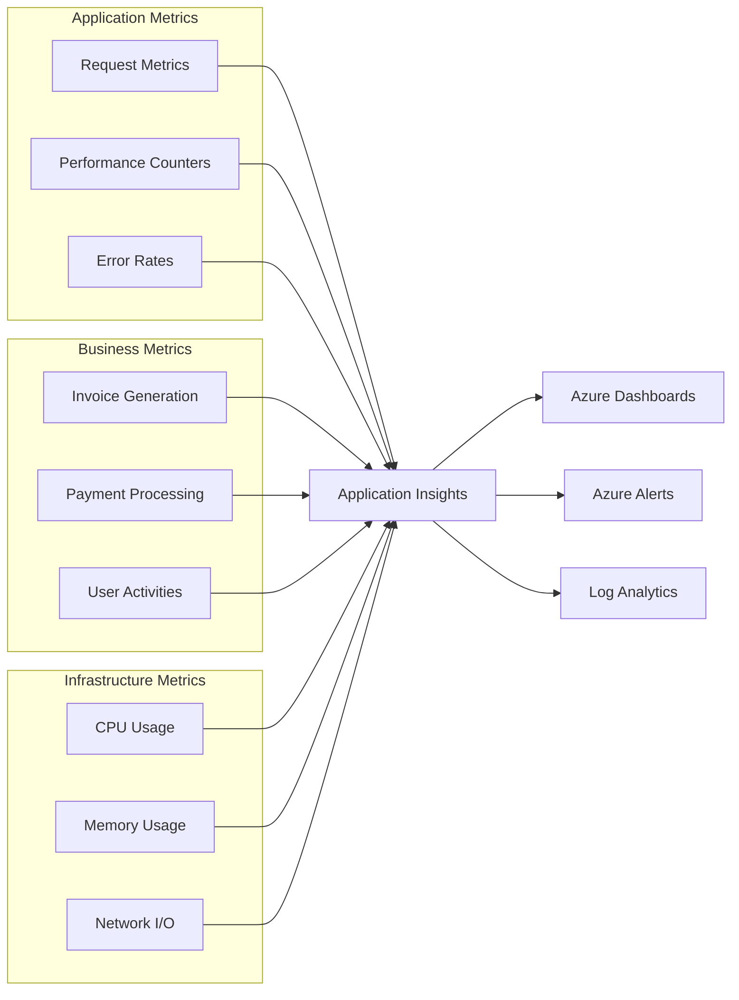

# Insurance Management System

A comprehensive microservices-based insurance management platform built on Azure, designed to handle multiple insurance types (Vehicle, Pet, Health) with automated billing, notifications, and document management capabilities.

## 🏗️ System Architecture



## 📋 Project Structure

```
insurance-management-system/
├── 📁 services/                    # Core business services
│   ├── 📁 insurance-management/    # Main insurance orchestration service
│   └── 📁 vehicle-insurance/       # Vehicle-specific insurance service
├── 📁 functions/                   # Azure Functions (serverless)
│   ├── 📁 billing-service/         # Automated billing and invoice generation
│   └── 📁 notification-service/    # Email and notification management
├── 📁 shared/                      # Shared libraries and models
├── 📁 infrastructure/              # Azure infrastructure as code (Bicep)
├── 📁 Tests/                       # Test projects
│   ├── 📁 insurance-management-Tests/
│   ├── 📁 vehicle-insurance-Tests/
│   └── 📁 IntegrationTests/
├── 📄 insurance-management-system.sln  # Visual Studio solution
├── 📄 release.sh                   # Production deployment script
├── 📄 optimize-and-deploy.sh       # Optimized build and deployment
└── 📄 Task.md                      # Project specifications
```

## 🚀 Core Features

### Insurance Management

- **Multi-Type Support**: Vehicle, Pet, and Health insurance
- **Coverage Plans**: Modular basic and complementary coverage tiers
- **Policy Management**: Template-based policy creation and management
- **Claims Processing**: Incident reporting and settlement tracking

### Financial Operations

- **Automated Billing**: Monthly invoice generation (27th of each month)
- **Payment Tracking**: Multiple payment methods with transaction history
- **Aggregated Invoicing**: Per-insurance consolidated billing
- **Email Notifications**: Automated invoice and payment notifications

### Document Management

- **Azure Storage Integration**: Secure document storage
- **Invoice Generation**: PDF invoice creation and storage
- **Policy Documents**: Contract and terms storage
- **Claims Documentation**: Evidence and settlement document management

## 🛠️ Technology Stack

### Core Technologies

- **.NET 8**: Backend services and functions
- **C#**: Primary programming language
- **Entity Framework Core**: Data access layer
- **Minimal APIs**: Lightweight API endpoints

### Azure Services

- **Azure App Services**: Hosting core microservices
- **Azure Functions**: Serverless processing (Timer & Service Bus triggers)
- **Azure SQL Database**: Primary data storage
- **Azure Storage Account**: Document and file storage
- **Azure Service Bus**: Message queuing and integration
- **Azure Application Insights**: Monitoring and telemetry
- **Azure API Management**: API gateway and management
- **Azure Virtual Network**: Network security and isolation
- **Azure Key Vault**: Secrets and configuration management

### Infrastructure

- **Bicep**: Infrastructure as Code
- **Azure Resource Manager**: Resource deployment
- **Docker**: Containerization support
- **GitHub Actions**: CI/CD pipelines

## 🏛️ Data Architecture



## 📦 Services Overview

### 1. Insurance Management Service

- **Purpose**: Central orchestration service for all insurance operations
- **Port**: 8080
- **Database**: InsuranceManagementDb
- **Key Features**: User management, policy orchestration, cross-service coordination

### 2. Vehicle Insurance Service

- **Purpose**: Vehicle-specific insurance data and coverage management
- **Port**: 8081
- **Database**: VehicleInsuranceDb
- **Key Features**: Vehicle registration, insurance coverage, claims processing

### 3. Billing Service Function

- **Trigger**: Timer (Monthly on 27th) + Service Bus
- **Purpose**: Automated invoice generation and billing processing
- **Key Features**: Monthly billing cycles, PDF invoice generation, payment tracking

### 4. Notification Service Function

- **Trigger**: Service Bus messages
- **Purpose**: Email notifications and user communications
- **Key Features**: Invoice notifications, payment reminders, system alerts

## 🔧 Configuration & Environment Variables

### Core Services Configuration

```json
{
  "SqlConnectionString": "Server=...;Database=...;",
  "StorageAccountConnectionString": "DefaultEndpointsProtocol=https;...",
  "ServiceBusConnectionString": "Endpoint=sb://...;",
  "ApplicationInsightsConnectionString": "InstrumentationKey=...",
  "KeyVaultEndpoint": "https://<keyvault-name>.vault.azure.net/"
}
```

### Function Apps Configuration

- **Timer Schedule**: `0 0 8 27 * *` (8:00 AM UTC on 27th of each month)
- **Service Bus Queues**:
  - `invoice-generation-queue`
  - `email-notification-queue`
  - `payment-notification-queue`

## 📊 Monitoring & Observability



## 🚀 Deployment

### Prerequisites

- Azure CLI installed and authenticated
- .NET 8 SDK
- Azure subscription with appropriate permissions

### Quick Deployment

```bash
# 1. Deploy infrastructure
cd infrastructure
./deploy.sh <resource-group-name> <stage>

# 2. Deploy all services (optimized build)
./optimize-and-deploy.sh <resource-group-name> <insurance-app-name>

# 3. Production deployment
./release.sh <resource-group-name> <stage>
```

### Infrastructure Deployment

The Bicep template deploys:

- Virtual Network with subnets
- Azure SQL Database with connection pooling
- Storage Account with containers
- Service Bus with queues
- Application Insights workspace
- Key Vault for secrets
- App Service Plans (Linux)
- Function Apps with managed identity

### Build Optimization

The deployment scripts include:

- **ReadyToRun compilation**: Faster startup times
- **Assembly trimming**: Reduced package size
- **Single-file publishing**: Simplified deployment
- **Size comparison**: Before/after optimization metrics

## 🔐 Security Features

- **Managed Identity**: Azure resources authentication
- **Key Vault Integration**: Secure secrets management
- **Virtual Network Integration**: Network-level security
- **Connection String Security**: No hardcoded credentials
- **RBAC**: Role-based access control
- **SSL/TLS**: Encrypted communication
- **API Gateway**: Centralized security policies

## 📈 Performance Characteristics

### Database Optimization

- **Connection Pooling**: Efficient database connections
- **Retry Policies**: Resilient database operations
- **Indexing Strategy**: Optimized query performance
- **Connection String Options**: `MaxRetryCount=5, MaxRetryDelay=30s`

### Service Performance

- **Health Checks**: Built-in health monitoring
- **Caching**: In-memory and distributed caching
- **Async Operations**: Non-blocking I/O operations
- **Bulk Operations**: Efficient batch processing

## 🧪 Testing Strategy

### Test Projects

- **Unit Tests**: Service-level testing
- **Integration Tests**: End-to-end API testing
- **Performance Tests**: Load and stress testing
- **Infrastructure Tests**: Bicep template validation

### Test Coverage Areas

- API endpoint functionality
- Database operations and transactions
- Service Bus message processing
- File storage operations
- Error handling and resilience
- Security and authentication

## 📚 API Documentation

### Swagger/OpenAPI

- **Development Environment**: Available at `/swagger`
- **API Versioning**: v1 endpoints
- **Authentication**: Bearer token support
- **Response Formats**: JSON with standardized error handling

### Key Endpoints

- `GET /api/v1/user/{personalId}` - User insurance overview
- `POST /api/v1/insurance` - Create new insurance
- `GET /api/v1/insurance/{id}/invoices` - Retrieve invoices
- `POST /api/v1/vehicle` - Register vehicle
- `GET /api/v1/policies` - Available policies

## 🔄 CI/CD Pipeline

### Build Process

1. **Code Quality**: Static analysis and linting
2. **Unit Tests**: Automated test execution
3. **Integration Tests**: API and database testing
4. **Security Scan**: Vulnerability assessment
5. **Build Optimization**: Size and performance optimization
6. **Artifact Creation**: Deployment packages

### Deployment Stages

1. **Development**: Automatic deployment on feature branches
2. **Staging**: Pre-production validation environment
3. **Production**: Manual approval with blue-green deployment

## 📞 Support & Maintenance

### Monitoring Alerts

- **Service Availability**: 99.9% uptime SLA
- **Response Time**: <500ms P95 response time
- **Error Rate**: <1% error threshold
- **Resource Usage**: CPU/Memory thresholds

### Backup & Recovery

- **Database Backups**: Daily automated backups with 30-day retention
- **Point-in-Time Recovery**: 7-day recovery window
- **Document Storage**: Geo-redundant storage with versioning
- **Configuration Backup**: Infrastructure as Code in source control

---

## 🏷️ Version Information

- **Version**: 1.0.0
- **Last Updated**: June 15, 2025
- **License**: MIT
- **Maintainer**: Insurance Management System Team

For detailed component documentation, see individual README files in each service and function directory.
