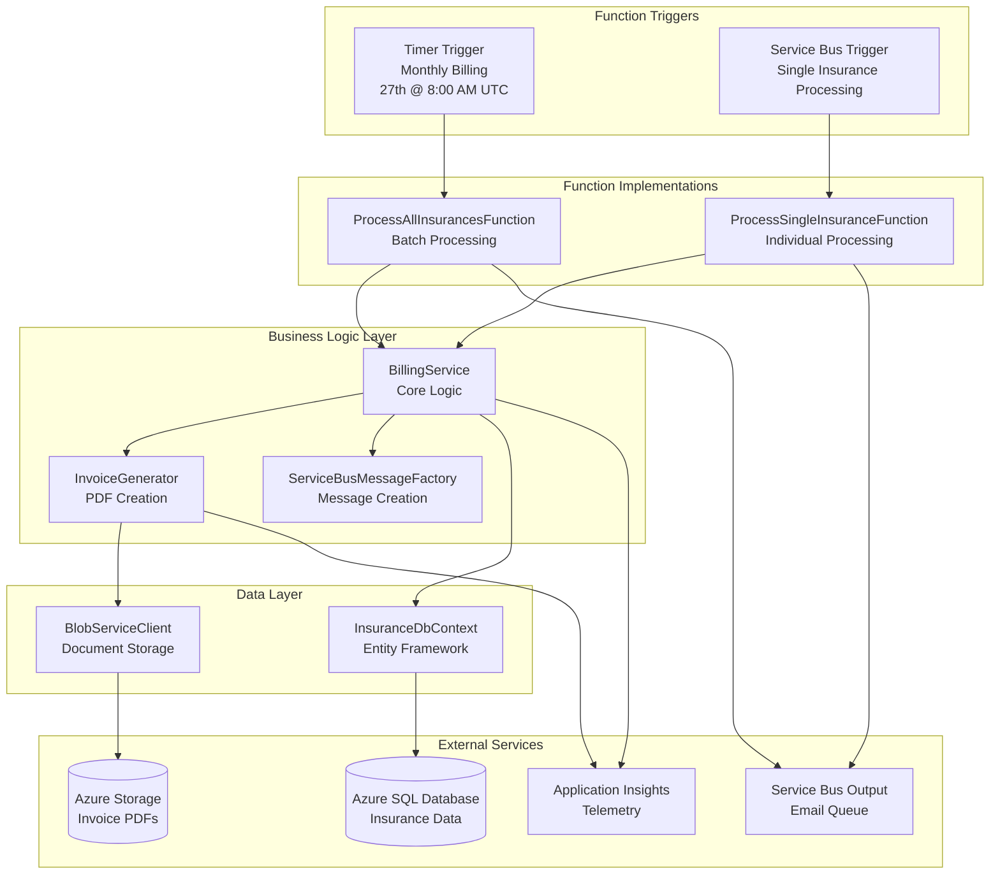

# Billing Service Function

An Azure Function App responsible for automated billing, invoice generation, and payment processing within the Insurance Management System.

## 🎯 Purpose

This serverless function provides:

- **Automated Monthly Billing**: Timer-triggered processing on the 27th of each month
- **On-Demand Invoice Generation**: Service Bus triggered individual invoice processing
- **PDF Invoice Creation**: Professional invoice document generation
- **Payment Processing Integration**: Billing cycle management
- **Email Notification Coordination**: Integration with notification services

## 🏗️ Function Architecture

## Overview

This Azure Function-based service handles the generation and management of invoices for the insurance management system.

## Features

- **ProcessAllInsurances**: Timer-triggered function that runs on the 27th day of each month to process all active insurance policies and generate invoices for the upcoming month.
- **ProcessSingleInsurance**: Service Bus-triggered function that processes a single insurance policy when a message is received on the configured queue.

## Architecture

The solution follows clean architecture principles with separation of concerns:

- **Functions**: `BillingServiceFunctions.cs` containing the Azure Functions entry points
- **Services**: Business logic implementations in `Services` folder
- **Data**: Database context and entity configurations in `Data` folder
- **Config**: Configuration model in `Config` folder
- **Shared Models**: Common models defined in the shared library

## Configuration

The service uses the following configuration parameters from `appsettings.json`:

- `SqlConnectionString`: SQL database connection string
- `SqlDatabaseName`: SQL database name
- `ServiceBusConnectionString`: Azure Service Bus connection string
- `ServiceBusNamespace`: Azure Service Bus namespace
- `SvbusInvoiceGenQueueName`: Queue name for processing single insurance billing requests
- `SvbusInvoiceEmailQueueName`: Queue name for sending email notifications with invoices
- `StorageAccountConnectionString`: Azure Storage connection string for storing invoice PDFs
- `InvoicesContainerName`: Blob container name for storing invoice PDFs
- `APPLICATIONINSIGHTS_CONNECTION_STRING`: Application Insights connection string for telemetry

## Local Development

### Prerequisites

- .NET 9 SDK
- Azure Functions Core Tools
- Access to the shared Azure PostgreSQL instance.
- Connection string for the database and Service Bus (e.g., in `local.settings.json`).

### Running the Function Locally

- Navigate to the function directory: `cd services/functions/billing-service`
- Start the function host: `func start`
- You can trigger TimerTrigger functions manually for testing via the Functions host admin endpoints or by adjusting the schedule for immediate execution in `function.json` (or C# attribute) for local testing.

### Testing Procedures

- Unit tests for the logic that queries active insurances and prepares messages.
- Mocking database and Service Bus dependencies.
- Integration testing locally might involve a local Azurite for Service Bus emulation or connecting to a dev Service Bus instance.

## Deployment

- **Azure DevOps Pipeline**: Deployed as part of the serverless functions deployment, likely managed by Bicep templates for the Function App and related resources.
- **Infrastructure**: Defined in Bicep (`functions/billing-service/function.bicep` or a shared functions Bicep module), including:
  - Azure Function App (Consumption Plan)
  - Application Insights integration
  - Managed Identity for database access
  - Configuration for Service Bus connection string.
- **Environment Configuration**: Application settings in Azure Function App configuration (e.g., database connection, Service Bus queue name).

## Error Handling, Extensibility, and Security

- **Error Handling**:
  - Try-catch blocks for critical operations (DB query, message sending).
  - Logging to Application Insights.
  - Dead-lettering is primarily handled by the message consumer (`InvoiceGeneratorFunction`), but the scheduler ensures messages are sent reliably.
- **Extensibility**:
  - The query for active insurances can be modified if criteria change.
  - Configuration for CRON schedule and queue names should be externalized.
- **Security**:
  - Managed Identity for accessing Azure PostgreSQL and Azure Service Bus.
  - Service Bus connection strings stored securely in Function App settings.
