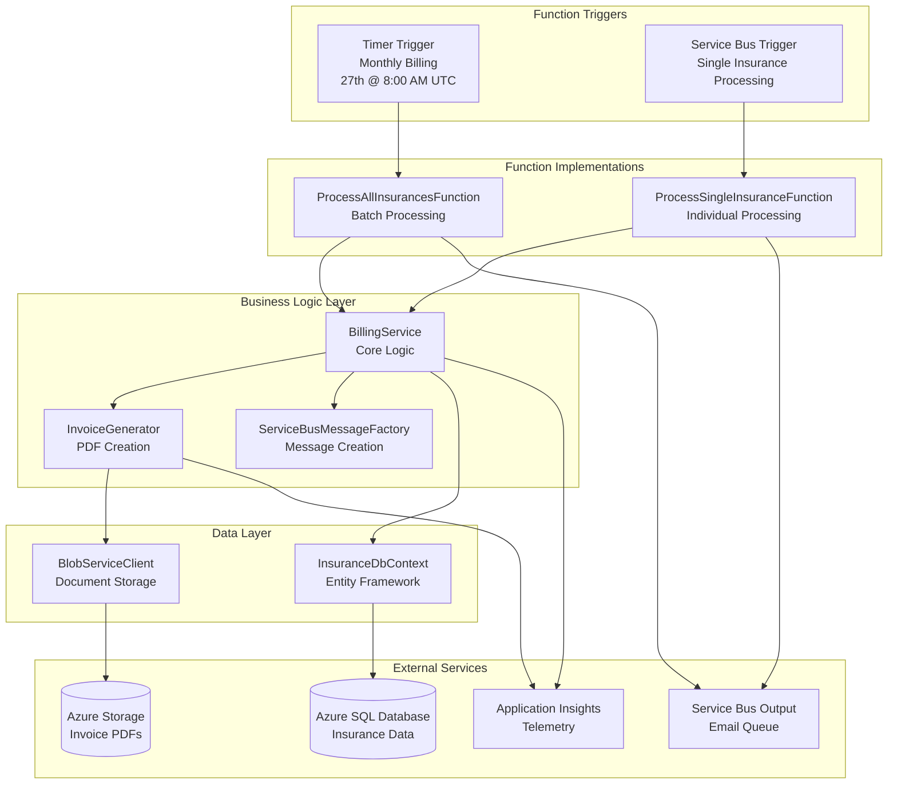

# Billing Service Function

An Azure Function App responsible for automated billing, invoice generation, and payment processing within the Insurance Management System.

## 🎯 Purpose

This serverless function provides:

- **Automated Monthly Billing**: Timer-triggered processing on the 27th of each month
- **On-Demand Invoice Generation**: Service Bus triggered individual invoice processing
- **PDF Invoice Creation**: Professional invoice document generation
- **Payment Processing Integration**: Billing cycle management
- **Email Notification Coordination**: Integration with notification services

## 🏗️ Function Architecture

## Overview

This Azure Function-based service handles the generation and management of invoices for the insurance management system.

## Features

- **ProcessAllInsurances**: Timer-triggered function that runs on the 27th day of each month to process all active insurance policies and generate invoices for the upcoming month.
- **ProcessSingleInsurance**: Service Bus-triggered function that processes a single insurance policy when a message is received on the configured queue.

## Architecture

The solution follows clean architecture principles with separation of concerns:

- **Functions**: `BillingServiceFunctions.cs` containing the Azure Functions entry points
- **Services**: Business logic implementations in `Services` folder
- **Data**: Database context and entity configurations in `Data` folder
- **Config**: Configuration model in `Config` folder
- **Shared Models**: Common models defined in the shared library

## Configuration

The service uses the following configuration parameters from `appsettings.json`:

- `SqlConnectionString`: SQL Server database connection string
- `SqlDatabaseName`: SQL database name
- `ServiceBusConnectionString`: Azure Service Bus connection string
- `ServiceBusNamespace`: Azure Service Bus namespace
- `SvbusInvoiceGenQueueName`: Queue name for processing single insurance billing requests (`invoice-generation-queue`)
- `SvbusInvoiceEmailQueueName`: Queue name for sending email notifications with invoices (`invoice-email-notification-queue`)
- `StorageAccountConnectionString`: Azure Storage connection string for storing invoice PDFs
- `InvoicesContainerName`: Blob container name for storing invoice PDFs (`invoices`)
- `APPLICATIONINSIGHTS_CONNECTION_STRING`: Application Insights connection string for telemetry

## Local Development

### Prerequisites

- .NET 8 SDK
- Azure Functions Core Tools
- Access to the shared Azure SQL Database instance
- Connection string for the database and Service Bus (e.g., in `local.settings.json`)

### Running the Function Locally

- Navigate to the function directory: `cd functions/billing-service`
- Start the function host: `func start`
- Timer function runs monthly on the 27th at 8:00 AM UTC (`0 0 27 * *`)
- You can test the Service Bus triggered function by sending messages to the configured queue

### Testing Procedures

- Unit tests for the logic that queries active insurances and prepares messages.
- Mocking database and Service Bus dependencies.
- Integration testing locally might involve a local Azurite for Service Bus emulation or connecting to a dev Service Bus instance.

## Deployment

- **Infrastructure**: Deployed via Bicep templates as part of the infrastructure deployment
- **Function App**: Windows hosting with .NET 8 runtime
- **Application Insights**: Integrated for monitoring and telemetry
- **Connection String Authentication**: Configured for secure access to Azure resources via connection strings
- **Environment Configuration**: Application settings configured via Bicep deployment

## Error Handling, Extensibility, and Security

- **Error Handling**:
  - Try-catch blocks for critical operations (DB query, message sending)
  - Logging to Application Insights
  - Dead-lettering handled by Service Bus for failed message processing
- **Extensibility**:
  - Configurable CRON schedule for timer trigger
  - Queue names externalized in configuration
  - Modular service design for easy enhancement
- **Security**:
  - HTTPS-only communication
  - Connection string authentication for accessing Azure resources
  - Service Bus connection strings stored securely in Function App settings
  - Virtual Network integration for network isolation
