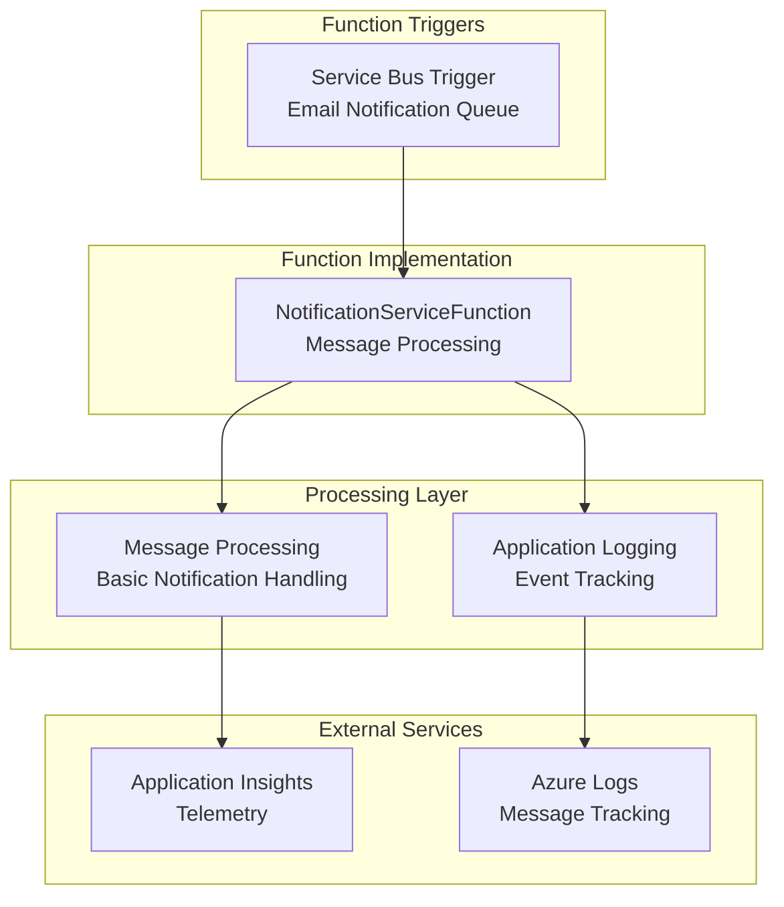
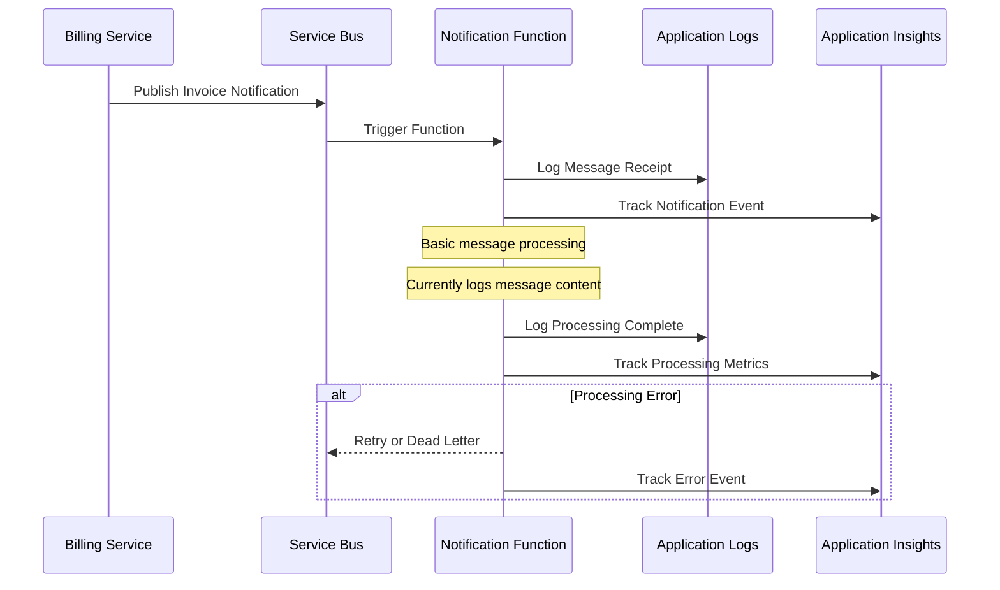

# Notification Service Function

An Azure Function App responsible for handling invoice email notifications and other communication within the Insurance Management System.

## 🎯 Purpose

This serverless function provides:

- **Email Invoice Notifications**: Automated invoice delivery notifications (currently logging-based)
- **Message Processing**: Service Bus triggered message handling
- **Notification Logging**: Comprehensive logging for notification events
- **Extensible Design**: Ready for future email/SMS service integration

## 🏗️ Function Architecture



## 📊 Notification Flow



## 🔧 Technical Stack

### Core Technologies

- **.NET 8**: Azure Functions runtime
- **Azure Functions Worker**: Isolated worker process model
- **C#**: Primary programming language
- **Service Bus Extensions**: Message processing

### Key Dependencies

```xml
<PackageReference Include="Azure.Messaging.ServiceBus" Version="7.19.0" />
<PackageReference Include="Azure.Storage.Blobs" Version="12.19.1" />
<PackageReference Include="Microsoft.ApplicationInsights.WorkerService" Version="2.23.0" />
<PackageReference Include="Microsoft.Azure.Functions.Worker" Version="2.0.0" />
<PackageReference Include="Microsoft.Azure.Functions.Worker.Extensions.ServiceBus" Version="5.22.2" />
<PackageReference Include="Microsoft.Extensions.Configuration" Version="8.0.0" />
```

### Azure Services Integration

- **Azure Functions**: Serverless compute platform
- **Azure Service Bus**: Message queuing and triggering
- **Azure Storage Blobs**: Configuration and logging support
- **Application Insights**: Monitoring and telemetry

## ⚡ Function Definitions

### NotificationServiceFunction

```csharp
[Function("NotificationService")]
public async Task Run(
    [ServiceBusTrigger("%SvbusInvoiceEmailQueueName%", Connection = "ServiceBusConnectionString")]
    ServiceBusReceivedMessage message,
    FunctionContext context)
```

**Purpose**: Process invoice notification messages from Service Bus queue
**Trigger**: Service Bus message (`invoice-email-notification-queue`)
**Processing**: Basic message logging and tracking (ready for email service integration)

## 📋 Message Types & Processing

### Email Invoice Notification

```json
{
  "messageType": "EmailInvoiceNotification",
  "recipientEmail": "customer@example.com",
  "recipientName": "John Doe",
  "personalId": "196001011234",
  "invoiceId": "456e7890-e89b-12d3-a456-426614174001",
  "invoiceNumber": "INV-2025-06-001",
  "totalAmount": 299.99,
  "dueDate": "2025-07-27T00:00:00Z",
  "invoicePdfPath": "https://storage.blob.core.windows.net/invoices/INV-2025-06-001.pdf",
  "emailTemplate": "MonthlyInvoice"
}
```

### Payment Reminder Notification

```json
{
  "messageType": "PaymentReminder",
  "recipientEmail": "customer@example.com",
  "recipientName": "John Doe",
  "personalId": "196001011234",
  "invoiceNumber": "INV-2025-05-001",
  "overdueAmount": 299.99,
  "daysPastDue": 7,
  "lateFeeAmount": 25.0,
  "emailTemplate": "PaymentReminder"
}
```

### Policy Update Notification

```json
{
  "messageType": "PolicyUpdate",
  "recipientEmail": "customer@example.com",
  "recipientName": "John Doe",
  "personalId": "196001011234",
  "policyId": "123e4567-e89b-12d3-a456-426614174000",
  "updateType": "CoverageChange",
  "effectiveDate": "2025-07-01T00:00:00Z",
  "description": "Added comprehensive coverage to your vehicle insurance",
  "emailTemplate": "PolicyUpdate"
}
```

### System Alert Notification

```json
{
  "messageType": "SystemAlert",
  "recipientEmail": "admin@insurancecompany.com",
  "alertType": "PaymentProcessingFailure",
  "severity": "High",
  "description": "Multiple payment processing failures detected",
  "affectedCustomers": 15,
  "timestamp": "2025-06-15T14:30:00Z",
  "emailTemplate": "SystemAlert"
}
```

## 📧 Email Templates

### Template Structure

```html
<!DOCTYPE html>
<html>
  <head>
    <meta charset="utf-8" />
    <title>{{EmailSubject}}</title>
    <style>
      /* Responsive email styles */
    </style>
  </head>
  <body>
    <div class="email-container">
      <header class="email-header">
        
        <h1>{{EmailSubject}}</h1>
      </header>

      <main class="email-content">
        {{#if IsInvoiceEmail}}
        <!-- Invoice-specific content -->
        <h2>Invoice {{InvoiceNumber}}</h2>
        <p>Dear {{CustomerName}},</p>
        <p>Your monthly insurance invoice is ready.</p>

        <div class="invoice-summary">
          <p><strong>Amount Due:</strong> {{TotalAmount}}</p>
          <p><strong>Due Date:</strong> {{DueDate}}</p>
        </div>
        {{/if}} {{#if IsPaymentReminder}}
        <!-- Payment reminder content -->
        <h2>Payment Reminder</h2>
        <p>Dear {{CustomerName}},</p>
        <p>This is a friendly reminder about your overdue payment.</p>
        {{/if}}
      </main>

      <footer class="email-footer">
        <p>Contact us: support@insurancecompany.com</p>
      </footer>
    </div>
  </body>
</html>
```

### Template Types

- **MonthlyInvoice**: Standard monthly billing notification
- **PaymentReminder**: Overdue payment notifications
- **PolicyUpdate**: Insurance policy change notifications
- **WelcomeEmail**: New customer onboarding
- **PolicyRenewal**: Annual policy renewal reminders
- **ClaimUpdate**: Insurance claim status updates
- **SystemAlert**: Administrative notifications

## ⚙️ Configuration

### Application Settings

```json
{
  "ServiceBusConnectionString": "Endpoint=sb://...;SharedAccessKeyName=...",
  "ApplicationInsightsConnectionString": "InstrumentationKey=...;IngestionEndpoint=...",
  "StorageAccountConnectionString": "DefaultEndpointsProtocol=https;...",
  "CommunicationServicesConnectionString": "endpoint=https://...;accesskey=...",
  "SvbusInvoiceEmailQueueName": "email-notification-queue",
  "SvbusSmsQueueName": "sms-notification-queue",
  "SvbusSystemAlertQueueName": "system-alert-queue",
  "EmailTemplateContainer": "email-templates",
  "EmailFromAddress": "noreply@insurancecompany.com",
  "EmailFromName": "Insurance Company"
}
```

### Environment Variables

- **SERVICEBUSCONNECTIONSTRING**: Message queue connection
- **COMMUNICATIONSERVICESCONNECTIONSTRING**: Email/SMS service connection
- **STORAGEACCOUNTCONNECTIONSTRING**: Template and asset storage
- **APPLICATIONINSIGHTS_CONNECTION_STRING**: Telemetry and monitoring
- **SVBUSINVOICEEMAILQUEUENAME**: Email notification queue
- **SVBUSSMSQUEUENAME**: SMS notification queue
- **SVBUSSYSTEMALERTQUEUENAME**: System alert queue

### Host Configuration (host.json)

```json
{
  "version": "2.0",
  "logging": {
    "applicationInsights": {
      "samplingSettings": {
        "isEnabled": true,
        "excludedTypes": "Request"
      }
    }
  },
  "functionTimeout": "00:10:00",
  "extensions": {
    "serviceBus": {
      "prefetchCount": 50,
      "messageHandlerOptions": {
        "autoComplete": false,
        "maxConcurrentCalls": 16,
        "maxAutoRenewDuration": "00:05:00"
      }
    }
  }
}
```

## 🔍 Monitoring & Telemetry

### Application Insights Integration

```csharp
// Track notification events
_telemetryClient.TrackEvent("NotificationSent", new Dictionary<string, string>
{
    ["MessageType"] = messageType,
    ["RecipientEmail"] = recipientEmail,
    ["NotificationChannel"] = "Email",
    ["DeliveryStatus"] = "Success"
});

// Track performance metrics
_telemetryClient.TrackMetric("NotificationProcessingTime", processingTime.TotalMilliseconds);
_telemetryClient.TrackMetric("DailyNotificationCount", notificationCount);

// Track delivery failures
_telemetryClient.TrackEvent("NotificationFailed", new Dictionary<string, string>
{
    ["MessageType"] = messageType,
    ["RecipientEmail"] = recipientEmail,
    ["FailureReason"] = ex.Message,
    ["RetryAttempt"] = retryCount.ToString()
});
```

### Key Metrics

- **Message Processing Rate**: Function throughput and performance
- **Delivery Success Rate**: Email/SMS delivery success percentage
- **Template Rendering Time**: Content generation performance
- **Queue Depth**: Service Bus message backlog
- **Error Rate**: Failed notification processing
- **Retry Frequency**: Message reprocessing statistics

### Alert Configuration

```csharp
// Critical alerts
- Notification delivery failure rate > 5%
- Function execution errors > 10 per hour
- Queue message age > 30 minutes
- Template rendering failures > 1%

// Warning alerts
- Average processing time > 30 seconds
- Daily notification volume deviation > 50%
- Storage account errors
- Communication service throttling
```

## 🏃‍♂️ Development & Testing

### Local Development

```bash
# Navigate to function directory
cd functions/notification-service

# Restore dependencies
dotnet restore

# Start Azure Functions Core Tools
func start

# Function will be available at http://localhost:7072
```

### Local Testing Configuration

```json
{
  "IsEncrypted": false,
  "Values": {
    "AzureWebJobsStorage": "UseDevelopmentStorage=true",
    "FUNCTIONS_WORKER_RUNTIME": "dotnet-isolated",
    "ServiceBusConnectionString": "Endpoint=sb://localhost;...",
    "StorageAccountConnectionString": "UseDevelopmentStorage=true",
    "CommunicationServicesConnectionString": "endpoint=https://localhost;accesskey=test"
  }
}
```

### Testing Email Templates

```bash
# Send test notification message
az servicebus message send \
  --resource-group $RESOURCE_GROUP \
  --namespace-name $SERVICEBUS_NAMESPACE \
  --queue-name email-notification-queue \
  --body '{
    "messageType": "EmailInvoiceNotification",
    "recipientEmail": "test@example.com",
    "recipientName": "Test User",
    "invoiceNumber": "INV-TEST-001",
    "totalAmount": 100.00,
    "emailTemplate": "MonthlyInvoice"
  }'
```

## 🚀 Deployment

### Azure Function App Deployment

```bash
# Build and publish
dotnet publish -c Release

# Deploy to Azure
func azure functionapp publish $NOTIFICATION_FUNCTION_NAME
```

### Infrastructure Requirements

- **Azure Function App**: Consumption or Premium plan
- **Azure Communication Services**: Email and SMS capabilities
- **Azure Storage Account**: Template and asset storage
- **Azure Service Bus**: Message queuing
- **Application Insights**: Monitoring and logging

### Scaling Configuration

```json
{
  "functionApp": {
    "scaleLimit": 100,
    "maximumElasticWorkerCount": 10
  },
  "functions": {
    "NotificationService": {
      "maxConcurrency": 16
    }
  }
}
```

## 🧪 Testing Strategy

### Unit Tests

- **Message Processing**: Notification message parsing and routing
- **Template Rendering**: Email content generation
- **Error Handling**: Exception scenarios and retry logic
- **Configuration Validation**: Settings and environment variables

### Integration Tests

- **Service Bus Integration**: Message consumption and processing
- **Communication Services**: Email and SMS delivery
- **Storage Integration**: Template retrieval and asset access
- **End-to-End Flow**: Complete notification delivery process

### Test Examples

```csharp
[Fact]
public async Task ProcessEmailNotification_ValidMessage_SendsEmail()
{
    // Arrange
    var message = new EmailInvoiceNotificationMessage
    {
        RecipientEmail = "test@example.com",
        InvoiceNumber = "INV-TEST-001",
        EmailTemplate = "MonthlyInvoice"
    };

    // Act
    await _notificationService.ProcessEmailNotificationAsync(message);

    // Assert
    Assert.True(_emailService.WasEmailSent);
    Assert.Equal("test@example.com", _emailService.LastRecipient);
}

[Fact]
public async Task RenderEmailTemplate_ValidData_ReturnsHtml()
{
    // Arrange
    var templateData = new { CustomerName = "John Doe", InvoiceNumber = "INV-001" };

    // Act
    var html = await _templateEngine.RenderAsync("MonthlyInvoice", templateData);

    // Assert
    Assert.Contains("John Doe", html);
    Assert.Contains("INV-001", html);
}
```

## 🔐 Security Considerations

### Access Control

- **Connection String Authentication**: Azure resource authentication via connection strings
- **Function-Level Security**: Function key authentication
- **Storage Access**: Connection string-based access to blob containers

### Data Protection

- **Personal Data Handling**: GDPR compliance for customer information
- **Email Security**: SPF, DKIM, and DMARC configuration
- **Template Security**: XSS prevention in dynamic content
- **Audit Logging**: Comprehensive notification tracking

### Input Validation

```csharp
public class EmailNotificationMessage
{
    [Required]
    [EmailAddress]
    public string RecipientEmail { get; set; } = string.Empty;

    [Required]
    [MaxLength(100)]
    public string RecipientName { get; set; } = string.Empty;

    [Required]
    public string MessageType { get; set; } = string.Empty;

    [Required]
    public string EmailTemplate { get; set; } = string.Empty;
}
```

## 🚨 Error Handling & Resilience

### Retry Policies

```csharp
// Service Bus retry configuration
services.Configure<ServiceBusProcessorOptions>(options =>
{
    options.MaxConcurrentCalls = 16;
    options.AutoCompleteMessages = false;
    options.MaxAutoLockRenewalDuration = TimeSpan.FromMinutes(5);
});

// Email delivery retry policy
var retryPolicy = new ExponentialBackoffRetryPolicy
{
    MaxRetries = 3,
    BaseDelay = TimeSpan.FromSeconds(2),
    MaxDelay = TimeSpan.FromMinutes(1)
};
```

### Dead Letter Queue Handling

- **Poison Message Detection**: Failed message routing to dead letter queue
- **Manual Review Process**: Admin interface for failed notifications
- **Error Analysis**: Detailed logging for delivery failures
- **Customer Notification**: Alternative communication channels for critical messages

### Delivery Status Tracking

```csharp
public enum NotificationStatus
{
    Pending,
    Processing,
    Delivered,
    Failed,
    Retrying,
    DeadLettered
}

// Track notification lifecycle
await _notificationStatusService.UpdateStatusAsync(notificationId, NotificationStatus.Delivered);
```

## 📚 Integration with Other Services

### Billing Service Function

- **Invoice Notifications**: Automated invoice delivery
- **Payment Processing**: Transaction confirmations and failures
- **Billing Cycle**: Monthly statement notifications

### Insurance Management Service

- **Policy Updates**: Coverage changes and renewals
- **User Registration**: Welcome emails and account activation
- **Claims Processing**: Status updates and settlement notifications

### Vehicle Insurance Service

- **Vehicle Registration**: Confirmation notifications
- **Insurance Updates**: Coverage modifications
- **Maintenance Reminders**: Vehicle inspection and service alerts

---

## 📞 Support Information

- **Function App Name**: notification-service
- **Runtime**: .NET 8 (Isolated Worker)
- **Trigger**: Service Bus (Multiple Queues)
- **Communication**: Azure Communication Services
- **Templates**: Azure Blob Storage
- **Monitoring**: Application Insights
- **Repository**: `functions/notification-service/`
