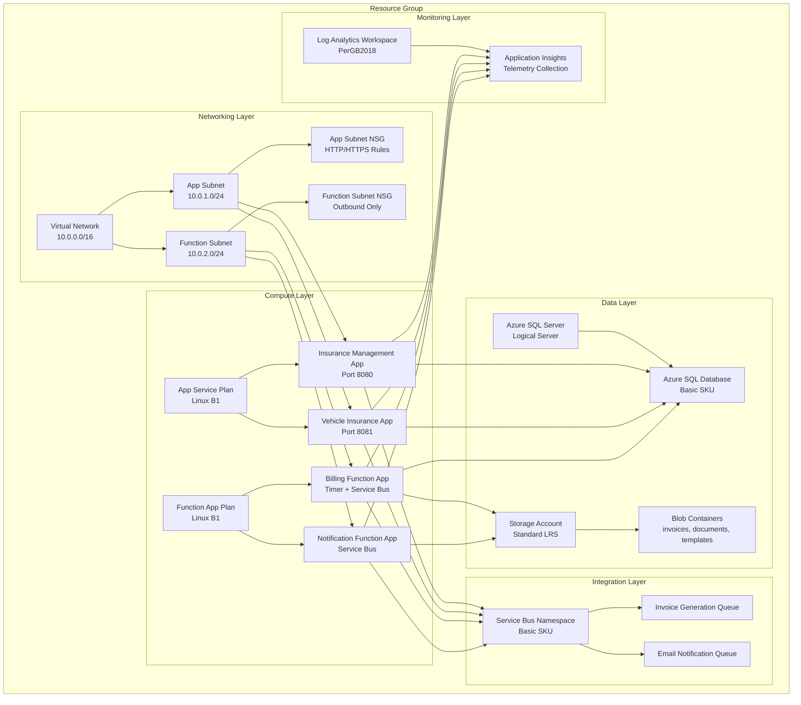

# Infrastructure

Azure infrastructure as code (IaC) using Bicep templates for the Insurance Management System, providing a complete cloud-native deployment architecture.

## 🎯 Purpose

This infrastructure provides:

- **Complete Azure Environment**: All required Azure services for the insurance system
- **Network Security**: Virtual network with subnets and security groups
- **Scalable Architecture**: App Service Plans and Function Apps with auto-scaling
- **Data Management**: Azure SQL Database with backup and disaster recovery
- **Message Queuing**: Service Bus for reliable message delivery
- **Monitoring & Observability**: Application Insights and Log Analytics
- **Storage Solutions**: Blob storage for documents and files

## 🏗️ Infrastructure Architecture



## 🔧 Resource Specifications

### Compute Resources

#### App Service Plans

```bicep
// Web Apps Plan
resource appServicePlan 'Microsoft.Web/serverfarms@2023-12-01' = {
  name: appServicePlanName
  location: location
  kind: 'linux'
  properties: {
    reserved: true  // Linux
  }
  sku: {
    name: 'B1'     // Basic tier
    tier: 'Basic'
    capacity: 1
  }
}

// Function Apps Plan
resource functionAppServicePlan 'Microsoft.Web/serverfarms@2023-12-01' = {
  name: functionAppServicePlanName
  location: location
  kind: 'functionapp'
  properties: {
    reserved: true  // Linux
  }
  sku: {
    name: 'B1'     // Basic tier for dedicated hosting
    tier: 'Basic'
    capacity: 1
  }
}
```

#### App Services

```bicep
// Insurance Management Service
resource insuranceManagementApp 'Microsoft.Web/sites@2023-12-01' = {
  name: insuranceManagementAppName
  location: location
  properties: {
    serverFarmId: appServicePlan.id
    virtualNetworkSubnetId: appSubnet.id
    siteConfig: {
      linuxFxVersion: 'DOTNETCORE|8.0'
      alwaysOn: true
      appSettings: [
        {
          name: 'ASPNETCORE_ENVIRONMENT'
          value: aspNetCoreEnvironment
        }
        {
          name: 'SqlConnectionString'
          value: sqlConnectionString
        }
        {
          name: 'ServiceBusConnectionString'
          value: listKeys(serviceBusNamespace.id, serviceBusNamespace.apiVersion).primaryConnectionString
        }
        {
          name: 'APPLICATIONINSIGHTS_CONNECTION_STRING'
          value: appInsights.properties.ConnectionString
        }
      ]
    }
  }
}
```

### Networking Resources

#### Virtual Network Configuration

```bicep
resource vnet 'Microsoft.Network/virtualNetworks@2024-05-01' = {
  name: vnetName
  location: location
  properties: {
    addressSpace: {
      addressPrefixes: ['10.0.0.0/16']
    }
    subnets: [
      {
        name: appSubnetName
        properties: {
          addressPrefix: '10.0.1.0/24'
          networkSecurityGroup: {
            id: appSubnetNsg.id
          }
          delegations: [
            {
              name: 'Microsoft.Web.serverFarms'
              properties: {
                serviceName: 'Microsoft.Web/serverFarms'
              }
            }
          ]
        }
      }
      {
        name: funcSubnetName
        properties: {
          addressPrefix: '10.0.2.0/24'
          networkSecurityGroup: {
            id: funcSubnetNsg.id
          }
          delegations: [
            {
              name: 'Microsoft.Web.serverFarms'
              properties: {
                serviceName: 'Microsoft.Web/serverFarms'
              }
            }
          ]
        }
      }
    ]
  }
}
```

#### Network Security Groups

```bicep
// App Subnet NSG - Allows HTTP/HTTPS traffic
resource appSubnetNsg 'Microsoft.Network/networkSecurityGroups@2024-05-01' = {
  name: '${appSubnetName}-nsg'
  location: location
  properties: {
    securityRules: [
      {
        name: 'AllowHTTP'
        properties: {
          priority: 100
          direction: 'Inbound'
          access: 'Allow'
          protocol: 'Tcp'
          sourcePortRange: '*'
          destinationPortRange: '80'
          sourceAddressPrefix: '*'
          destinationAddressPrefix: '*'
        }
      }
      {
        name: 'AllowHTTPS'
        properties: {
          priority: 110
          direction: 'Inbound'
          access: 'Allow'
          protocol: 'Tcp'
          sourcePortRange: '*'
          destinationPortRange: '443'
          sourceAddressPrefix: '*'
          destinationAddressPrefix: '*'
        }
      }
    ]
  }
}
```

### Data Layer Resources

#### Azure SQL Database

```bicep
resource sqlServer 'Microsoft.Sql/servers@2023-08-01-preview' = {
  name: sqlServerName
  location: location
  properties: {
    administratorLogin: sqlAdminUsernameParam
    administratorLoginPassword: sqlAdminPassword
    version: '12.0'
    minimalTlsVersion: '1.2'
    publicNetworkAccess: 'Enabled'
  }
}

resource sqlDatabase 'Microsoft.Sql/servers/databases@2023-08-01-preview' = {
  parent: sqlServer
  name: sqlDbName
  location: location
  sku: {
    name: 'Basic'
    tier: 'Basic'
    capacity: 5
  }
  properties: {
    collation: 'SQL_Latin1_General_CP1_CI_AS'
    maxSizeBytes: 2147483648  // 2GB
    catalogCollation: 'SQL_Latin1_General_CP1_CI_AS'
    zoneRedundant: false
    readScale: 'Disabled'
    requestedBackupStorageRedundancy: 'Local'
  }
}
```

#### Storage Account

```bicep
resource storageAccount 'Microsoft.Storage/storageAccounts@2023-05-01' = {
  name: storageAccountName
  location: location
  sku: {
    name: 'Standard_LRS'
  }
  kind: 'StorageV2'
  properties: {
    dnsEndpointType: 'Standard'
    defaultToOAuthAuthentication: false
    publicNetworkAccess: 'Enabled'
    allowCrossTenantReplication: false
    minimumTlsVersion: 'TLS1_2'
    allowBlobPublicAccess: false
    allowSharedKeyAccess: true
    networkAcls: {
      bypass: 'AzureServices'
      virtualNetworkRules: []
      ipRules: []
      defaultAction: 'Allow'
    }
    supportsHttpsTrafficOnly: true
    encryption: {
      requireInfrastructureEncryption: false
      services: {
        file: {
          keyType: 'Account'
          enabled: true
        }
        blob: {
          keyType: 'Account'
          enabled: true
        }
      }
      keySource: 'Microsoft.Storage'
    }
  }
}
```

### Message Queuing Resources

#### Service Bus Namespace and Queues

```bicep
resource serviceBusNamespace 'Microsoft.ServiceBus/namespaces@2024-01-01' = {
  name: serviceBusNamespaceName
  location: location
  sku: {
    name: 'Basic'
    tier: 'Basic'
  }
  properties: {
    minimumTlsVersion: '1.2'
    publicNetworkAccess: 'Enabled'
    disableLocalAuth: false
    zoneRedundant: false
  }
}

resource invoiceGenerationQueue 'Microsoft.ServiceBus/namespaces/queues@2024-01-01' = {
  parent: serviceBusNamespace
  name: invoiceGenQueueName
  properties: {
    lockDuration: 'PT5M'
    maxSizeInMegabytes: 1024
    requiresDuplicateDetection: false
    requiresSession: false
    defaultMessageTimeToLive: 'P14D'
    deadLetteringOnMessageExpiration: true
    maxDeliveryCount: 5
    enablePartitioning: false
    enableExpress: false
  }
}

resource invoiceEmailQueue 'Microsoft.ServiceBus/namespaces/queues@2024-01-01' = {
  parent: serviceBusNamespace
  name: invoiceQueueName
  properties: {
    lockDuration: 'PT5M'
    maxSizeInMegabytes: 1024
    requiresDuplicateDetection: false
    requiresSession: false
    defaultMessageTimeToLive: 'P14D'
    deadLetteringOnMessageExpiration: true
    maxDeliveryCount: 3
    enablePartitioning: false
    enableExpress: false
  }
}
```

### Monitoring Resources

#### Application Insights and Log Analytics

```bicep
resource logAnalyticsWorkspace 'Microsoft.OperationalInsights/workspaces@2023-09-01' = {
  name: logAnalyticsWorkspaceName
  location: location
  properties: {
    sku: {
      name: 'PerGB2018'
    }
    retentionInDays: 30
    features: {
      searchVersion: 1
      legacy: 0
      enableLogAccessUsingOnlyResourcePermissions: true
    }
  }
}

resource appInsights 'Microsoft.Insights/components@2020-02-02' = {
  name: appInsightsName
  location: location
  kind: 'web'
  properties: {
    Application_Type: 'web'
    Flow_Type: 'Redfield'
    Request_Source: 'IbizaAIExtension'
    RetentionInDays: 90
    WorkspaceResourceId: logAnalyticsWorkspace.id
    IngestionMode: 'LogAnalytics'
    publicNetworkAccessForIngestion: 'Enabled'
    publicNetworkAccessForQuery: 'Enabled'
  }
}
```

## 📋 Resource Naming Convention

### Naming Strategy

The infrastructure uses a consistent naming pattern: `{stage}-{resource-type}-{unique-suffix}`

### Generated Resource Names

```bash
# Examples for 'dev' stage with unique suffix 'a1b2c3d4'
dev-insurance-a1b2c3d4      # Insurance Management App
dev-vehicle-a1b2c3d4        # Vehicle Insurance App
dev-billing-a1b2c3d4        # Billing Function App
dev-notify-a1b2c3d4         # Notification Function App
dev-sql-a1b2c3d4            # SQL Server
dev-sb-a1b2c3d4             # Service Bus Namespace
dev-appi-a1b2c3d4           # Application Insights
dev-law-a1b2c3d4            # Log Analytics Workspace
devstoragea1b2c3d4          # Storage Account (no dashes)
```

### Static Resource Names

```bash
dev-vnet                    # Virtual Network
dev-app-subnet             # App Service Subnet
dev-func-subnet            # Function App Subnet
dev-asplan-apps            # App Service Plan for Web Apps
dev-asplan-funcs           # App Service Plan for Functions
```

## ⚙️ Deployment Configuration

### Bicep Parameters

```bicep
@description('Location for all resources.')
param location string = resourceGroup().location

@description('The ASP.NET Core environment setting.')
param aspNetCoreEnvironment string = 'Development'

@description('SKU name for the App Service Plans.')
param appServicePlanSkuName string = 'B1'

@description('SKU tier for the App Service Plans.')
param appServicePlanSkuTier string = 'Basic'

@description('SKU name for the SQL Database.')
param sqlSkuName string = 'Basic'

@description('SKU name for the Service Bus Namespace.')
param serviceBusSkuName string = 'Basic'

@description('SKU name for the Storage Account.')
param storageSkuName string = 'Standard_LRS'

@description('Retention period in days for Log Analytics.')
param logAnalyticsRetentionInDays int = 30

@description('Admin password for the SQL Server.')
@secure()
param sqlAdminPassword string
```

### Environment-Specific Configurations

#### Development Environment

```json
{
  "aspNetCoreEnvironment": "Development",
  "appServicePlanSkuName": "B1",
  "appServicePlanSkuTier": "Basic",
  "sqlSkuName": "Basic",
  "serviceBusSkuName": "Basic",
  "storageSkuName": "Standard_LRS",
  "logAnalyticsRetentionInDays": 30
}
```

#### Production Environment

```json
{
  "aspNetCoreEnvironment": "Production",
  "appServicePlanSkuName": "P1V2",
  "appServicePlanSkuTier": "PremiumV2",
  "sqlSkuName": "S2",
  "serviceBusSkuName": "Standard",
  "storageSkuName": "Standard_GRS",
  "logAnalyticsRetentionInDays": 90
}
```

## 🚀 Deployment Process

### Prerequisites

```bash
# Install Azure CLI
curl -sL https://aka.ms/InstallAzureCLIDeb | sudo bash

# Login to Azure
az login

# Set subscription (if needed)
az account set --subscription "your-subscription-id"
```

### Deployment Script Usage

```bash
# Navigate to infrastructure directory
cd infrastructure

# Make script executable
chmod +x deploy.sh

# Run deployment script
./deploy.sh

# The script will prompt for:
# - Environment/stage [dev]
# - Resource group name [dev-insurance-rg]
# - Azure location [swedencentral]
# - SQL admin password [ComplexPass123!]
```

### Manual Deployment

```bash
# Create resource group
az group create --name "dev-insurance-rg" --location "swedencentral"

# Deploy Bicep template
az deployment group create \
  --resource-group "dev-insurance-rg" \
  --template-file "insurance-infra.bicep" \
  --parameters \
    vnetName="dev-vnet" \
    appSubnetName="dev-app-subnet" \
    funcSubnetName="dev-func-subnet" \
    appServicePlanName="dev-asplan-apps" \
    functionAppServicePlanName="dev-asplan-funcs" \
    insuranceManagementAppName="dev-insurance-a1b2c3d4" \
    vehicleInsuranceAppName="dev-vehicle-a1b2c3d4" \
    billingServiceFunctionName="dev-billing-a1b2c3d4" \
    notificationServiceFunctionName="dev-notify-a1b2c3d4" \
    storageAccountName="devstoragea1b2c3d4" \
    sqlServerName="dev-sql-a1b2c3d4" \
    serviceBusNamespaceName="dev-sb-a1b2c3d4" \
    appInsightsName="dev-appi-a1b2c3d4" \
    logAnalyticsWorkspaceName="dev-law-a1b2c3d4" \
    sqlAdminPassword="YourSecurePassword123!"
```

## 🔍 Infrastructure Outputs

### Connection Strings

```bicep
output sqlConnectionString string = 'Server=${sqlServer.properties.fullyQualifiedDomainName};Database=${sqlDbName};User ID=${sqlAdminUsernameParam};Password=${sqlAdminPassword};Encrypt=true;TrustServerCertificate=false;Connection Timeout=30;'

output serviceBusConnectionString string = listKeys(serviceBusNamespace.id, serviceBusNamespace.apiVersion).primaryConnectionString

output storageAccountConnectionString string = 'DefaultEndpointsProtocol=https;AccountName=${storageAccount.name};AccountKey=${storageAccount.listKeys().keys[0].value};EndpointSuffix=${environment().suffixes.storage}'

output applicationInsightsConnectionString string = appInsights.properties.ConnectionString
```

### Resource Information

```bicep
output resourceGroupName string = resourceGroup().name
output location string = location
output vnetId string = vnet.id
output sqlServerFqdn string = sqlServer.properties.fullyQualifiedDomainName
output storageAccountName string = storageAccount.name
output serviceBusNamespaceName string = serviceBusNamespace.name
output appInsightsName string = appInsights.name
output logAnalyticsWorkspaceId string = logAnalyticsWorkspace.id
```

## 📊 Cost Estimation

### Basic Tier (Development)

| Resource              | SKU           | Estimated Monthly Cost (USD) |
| --------------------- | ------------- | ---------------------------- |
| App Service Plan (2x) | B1            | $27.00                       |
| Azure SQL Database    | Basic         | $5.00                        |
| Storage Account       | Standard LRS  | $2.00                        |
| Service Bus           | Basic         | $0.05                        |
| Application Insights  | Pay-as-you-go | $2.30                        |
| Log Analytics         | PerGB2018     | $2.30                        |
| **Total**             |               | **~$38.65**                  |

### Standard Tier (Production)

| Resource              | SKU           | Estimated Monthly Cost (USD) |
| --------------------- | ------------- | ---------------------------- |
| App Service Plan (2x) | P1V2          | $146.00                      |
| Azure SQL Database    | S2            | $30.00                       |
| Storage Account       | Standard GRS  | $4.00                        |
| Service Bus           | Standard      | $10.00                       |
| Application Insights  | Pay-as-you-go | $23.00                       |
| Log Analytics         | PerGB2018     | $23.00                       |
| **Total**             |               | **~$236.00**                 |

_Note: Costs are estimates and may vary based on usage, region, and current Azure pricing._

## 🔐 Security Configurations

### Network Security

```bicep
// SSL/TLS Configuration
httpsOnly: true
minTlsVersion: '1.2'

// Public Access Control
publicNetworkAccess: 'Enabled'  // Controlled by NSG rules
allowBlobPublicAccess: false

// Virtual Network Integration
virtualNetworkSubnetId: appSubnet.id
```

### Database Security

```bicep
// SQL Server Configuration
properties: {
  minimalTlsVersion: '1.2'
  publicNetworkAccess: 'Enabled'
  restrictOutboundNetworkAccess: 'Disabled'
}

// Firewall Rules
resource allowAzureServices 'Microsoft.Sql/servers/firewallRules@2023-08-01-preview' = {
  parent: sqlServer
  name: 'AllowAllWindowsAzureIps'
  properties: {
    startIpAddress: '0.0.0.0'
    endIpAddress: '0.0.0.0'
  }
}
```

### Storage Security

```bicep
properties: {
  minimumTlsVersion: 'TLS1_2'
  allowBlobPublicAccess: false
  allowSharedKeyAccess: true
  supportsHttpsTrafficOnly: true
  encryption: {
    services: {
      blob: { enabled: true }
      file: { enabled: true }
    }
    keySource: 'Microsoft.Storage'
  }
}
```

## 🔄 Disaster Recovery & Backup

### Database Backup

- **Automated Backups**: Enabled by default for Azure SQL Database
- **Point-in-Time Recovery**: 7-day retention for Basic tier
- **Long-term Retention**: Configurable for production environments
- **Geo-Redundant Backup**: Available in Standard tier and above

### Storage Redundancy

- **Development**: Local Redundant Storage (LRS)
- **Production**: Geo-Redundant Storage (GRS)
- **Availability**: 99.9% SLA for LRS, 99.99% for GRS

### Application Resilience

- **Auto-scaling**: Configured on App Service Plans
- **Health Checks**: Enabled for all app services
- **Retry Policies**: Implemented in application code
- **Circuit Breakers**: Built into service communication

## 📈 Monitoring & Alerts

### Application Insights Monitoring

```bicep
// Automatic telemetry collection for:
// - Request/response metrics
// - Dependency tracking
// - Exception logging
// - Performance counters
// - Custom business events
```

### Log Analytics Queries

```kql
// Application Performance
requests
| where timestamp > ago(1h)
| summarize avg(duration), count() by name
| order by avg_duration desc

// Error Analysis
exceptions
| where timestamp > ago(24h)
| summarize count() by type, outerMessage
| order by count_ desc

// Service Bus Metrics
ServiceBusLogs
| where TimeGenerated > ago(1h)
| summarize MessageCount = count() by QueueName, bin(TimeGenerated, 5m)
```

### Recommended Alerts

```bicep
// High Error Rate Alert
{
  "alertName": "High Error Rate",
  "condition": "requests | where resultCode >= 400 | summarize count()",
  "threshold": 10,
  "frequency": "PT5M",
  "severity": 2
}

// Database Connection Failures
{
  "alertName": "Database Connection Failures",
  "condition": "dependencies | where type == 'SQL' and success == false",
  "threshold": 5,
  "frequency": "PT1M",
  "severity": 1
}
```

## 🧪 Testing Infrastructure

### Infrastructure Testing

```bash
# Validate Bicep template
az bicep build --file insurance-infra.bicep

# Run what-if deployment
az deployment group what-if \
  --resource-group "dev-insurance-rg" \
  --template-file "insurance-infra.bicep" \
  --parameters @parameters.json

# Validate deployed resources
az resource list --resource-group "dev-insurance-rg" --output table
```

### Connectivity Testing

```bash
# Test SQL Database connectivity
sqlcmd -S dev-sql-a1b2c3d4.database.windows.net -d devsqldb -U sqladmin -P

# Test Service Bus connectivity
az servicebus queue show \
  --resource-group "dev-insurance-rg" \
  --namespace-name "dev-sb-a1b2c3d4" \
  --name "invoice-generation-queue"

# Test Storage Account access
az storage blob list \
  --account-name "devstoragea1b2c3d4" \
  --container-name "invoices"
```

## 📚 Maintenance & Updates

### Resource Updates

```bash
# Update App Service Plan SKU
az appservice plan update \
  --resource-group "dev-insurance-rg" \
  --name "dev-asplan-apps" \
  --sku P1V2

# Scale database
az sql db update \
  --resource-group "dev-insurance-rg" \
  --server "dev-sql-a1b2c3d4" \
  --name "devsqldb" \
  --service-objective S1
```

### Configuration Management

```bash
# Update app settings
az webapp config appsettings set \
  --resource-group "dev-insurance-rg" \
  --name "dev-insurance-a1b2c3d4" \
  --settings ASPNETCORE_ENVIRONMENT=Production

# Update function app settings
az functionapp config appsettings set \
  --resource-group "dev-insurance-rg" \
  --name "dev-billing-a1b2c3d4" \
  --settings AzureWebJobsStorage="new-connection-string"
```

---

## 📞 Support Information

- **Template File**: `insurance-infra.bicep`
- **Deployment Script**: `deploy.sh`
- **Target Platform**: Azure Resource Manager
- **Template Version**: Latest ARM template API versions
- **Supported Regions**: All Azure regions
- **Repository**: `infrastructure/`
