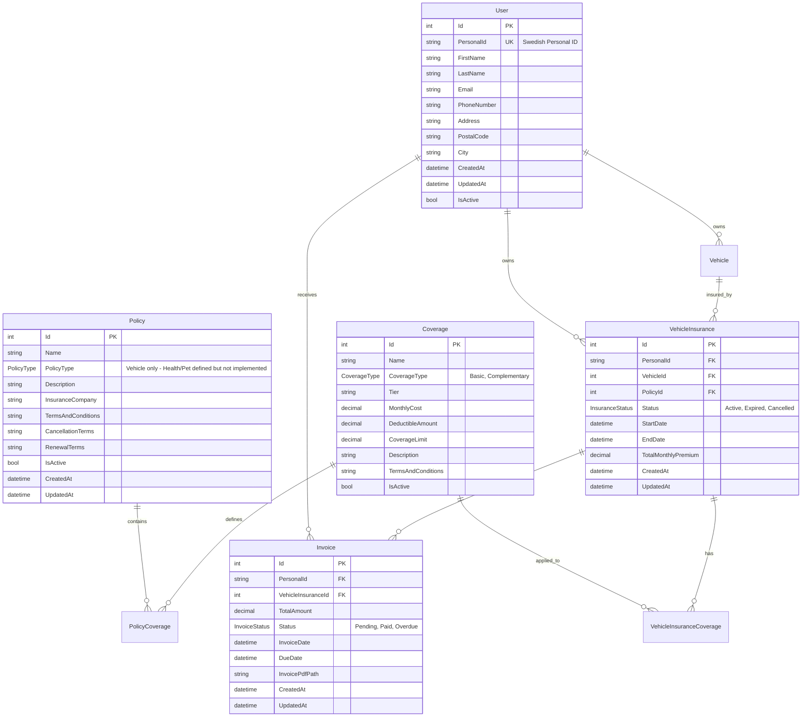

# Insurance Management Service

The core orchestration service for the Insurance Management System, responsible for managing users, policies, coverages, and coordinating with other microservices in the system.

## 🎯 Purpose

This service acts as the central hub for insurance operations, providing:

- User and policy management
- Cross-service orchestration
- Core business logic implementation
- Data consistency across the system

## 🏗️ Service Architecture


## 📊 Database Schema



## 🔧 Technical Stack

### Core Technologies

- **.NET 8**: Modern web API framework
- **C#**: Primary programming language with nullable reference types
- **Minimal APIs**: Lightweight endpoint definitions
- **Entity Framework Core 8.0.6**: Object-relational mapping

### Key Dependencies

```xml
<PackageReference Include="Azure.Messaging.ServiceBus" Version="7.18.1" />
<PackageReference Include="Microsoft.AspNetCore.OpenApi" Version="8.0.6" />
<PackageReference Include="Microsoft.EntityFrameworkCore.Design" Version="8.0.6" />
<PackageReference Include="Microsoft.EntityFrameworkCore.InMemory" Version="8.0.6" />
<PackageReference Include="Swashbuckle.AspNetCore" Version="6.5.0" />
```

### Azure Integrations

- **Azure SQL Database**: Primary data storage with connection pooling
- **Azure Service Bus**: Message-driven communication
- **Application Insights**: Telemetry and monitoring
- **Azure Storage**: Document and file management (configured but not actively used)

## 🌐 API Endpoints

### Insurance Management

```http
GET    /insurances/{id:guid}           # Get insurance by ID
GET    /insurances/user/{personalId}   # Get all insurances for a user
POST   /insurances                     # Create new insurance
```

### Health Check

```http
GET    /health                         # Service health status
```

### Documentation

```http
GET    /swagger                        # API documentation (Development only)
```

## 📋 Request/Response Models

### Create Insurance Request

```json
{
  "personalId": "196001011234",
  "vehicleId": 1,
  "policyId": 1,
  "selectedCoverageIds": [1, 2, 3],
  "startDate": "2025-01-01T00:00:00Z"
}
```

### Insurance Response

```json
{
  "id": "123e4567-e89b-12d3-a456-426614174000",
  "personalId": "196001011234",
  "vehicleId": 1,
  "policyId": 1,
  "status": "Active",
  "startDate": "2025-01-01T00:00:00Z",
  "endDate": "2025-12-31T23:59:59Z",
  "totalMonthlyPremium": 299.99,
  "coverages": [
    {
      "id": 1,
      "name": "Basic Vehicle Coverage",
      "monthlyCost": 199.99,
      "deductibleAmount": 5000.0,
      "coverageLimit": 1000000.0
    }
  ],
  "createdAt": "2025-01-01T10:00:00Z",
  "updatedAt": "2025-01-01T10:00:00Z"
}
```

## ⚙️ Configuration

### Application Settings

```json
{
  "ConnectionStrings": {
    "DefaultConnection": "Server=...;Database=InsuranceManagementDb;..."
  },
  "SqlConnectionString": "Server=...;Database=InsuranceManagementDb;...",
  "ServiceBusConnectionString": "Endpoint=sb://...;SharedAccessKeyName=...",
  "ApplicationInsightsConnectionString": "InstrumentationKey=...;IngestionEndpoint=...",
  "StorageAccountConnectionString": "DefaultEndpointsProtocol=https;..."
}
```

### Environment Variables

- **SQLCONNECTIONSTRING**: Azure SQL Database connection
- **SERVICEBUSCONNECTIONSTRING**: Service Bus namespace connection
- **APPLICATIONINSIGHTS_CONNECTION_STRING**: Application Insights telemetry
- **STORAGEACCOUNTCONNECTIONSTRING**: Azure Storage account

## 🔄 Service Bus Integration

### Message Publishing


### Message Types

- **Invoice Generation**: Triggers billing function for new policies
- **Email Notification**: Sends email notifications via notification service

## 🔍 Monitoring & Observability

### Application Insights Integration

```csharp
// Business Event Tracking
appInsights.TrackBusinessEvent("Insurance.Created", new Dictionary<string, string>
{
    ["InsuranceId"] = insurance.Id.ToString(),
    ["PersonalId"] = insurance.PersonalId,
    ["PolicyType"] = insurance.Policy.PolicyType.ToString()
});

// Performance Tracking
await appInsights.TrackOperationAsync(
    "Service.CreateInsurance",
    async () => await CreateInsuranceAsync(request),
    telemetryProperties
);
```

### Key Metrics

- **Request Duration**: API endpoint response times
- **Database Operations**: Entity Framework query performance
- **Service Bus Messages**: Message publishing and consumption rates
- **Business Events**: Insurance creation, updates, and cancellations
- **Error Rates**: Exception tracking and error patterns

## 🏃‍♂️ Development & Deployment

### Local Development

```bash
# Restore dependencies
dotnet restore

# Start the service
dotnet run --project insurance-management.csproj

# Service will be available at http://localhost:5223 (default port)
```

### Docker Support

```dockerfile
FROM mcr.microsoft.com/dotnet/aspnet:8.0 AS base
WORKDIR /app
EXPOSE 8080

FROM mcr.microsoft.com/dotnet/sdk:8.0 AS build
WORKDIR /src
COPY ["insurance-management.csproj", "."]
RUN dotnet restore

COPY . .
RUN dotnet build -c Release -o /app/build

FROM build AS publish
RUN dotnet publish -c Release -o /app/publish

FROM base AS final
WORKDIR /app
COPY --from=publish /app/publish .
ENTRYPOINT ["dotnet", "insurance-management.dll"]
```

### Production Deployment

```bash
# Build optimized package
dotnet publish -c Release -r linux-x64 --self-contained false

# Deploy to Azure App Service
az webapp deployment source config-zip \
  --resource-group $RESOURCE_GROUP \
  --name $APP_NAME \
  --src ./publish.zip
```

## 🧪 Testing Strategy

### Unit Tests

- Service layer business logic validation
- Entity mapping and data transformation
- Repository pattern implementation
- Error handling scenarios

### Integration Tests

- API endpoint functionality
- Database operations and transactions
- Service Bus message handling
- External service integration

### Test Coverage Areas

```csharp
[Test]
public async Task CreateInsurance_ValidRequest_ReturnsInsuranceDto()
{
    // Arrange
    var request = new CreateInsuranceRequest { ... };

    // Act
    var result = await _insuranceService.CreateAsync(request);

    // Assert
    Assert.NotNull(result);
    Assert.Equal(request.PersonalId, result.PersonalId);
}
```

## 🔐 Security Considerations

### Authentication & Authorization

- **Connection String Authentication**: Azure resource authentication via connection strings
- **Bearer Token**: API endpoint security (if implemented)
- **Application-Level Access**: Basic service access control

### Data Protection

- **Connection String Security**: No hardcoded credentials
- **Sensitive Data Handling**: Personal ID encryption
- **Audit Logging**: All data access operations logged

### Input Validation

```csharp
public record CreateInsuranceRequest
{
    [Required]
    [RegularExpression(@"^\d{10,12}$")]
    public string PersonalId { get; init; } = string.Empty;

    [Required]
    [Range(1, int.MaxValue)]
    public int VehicleId { get; init; }

    [Required]
    public DateTime StartDate { get; init; }
}
```

## 📈 Performance Optimizations

### Database Performance

- **Connection Pooling**: Efficient database connections
- **Retry Policies**: Resilient operations with exponential backoff
- **Optimized Queries**: Entity Framework query optimization
- **Indexing Strategy**: Database performance tuning

### Memory Management

- **Async Operations**: Non-blocking I/O operations
- **Resource Disposal**: Proper using statement patterns
- **Caching**: In-memory caching for frequently accessed data

### Build Optimizations

```xml
<PropertyGroup Condition="'$(Configuration)' == 'Release'">
  <SelfContained>false</SelfContained>
  <RuntimeIdentifier>linux-x64</RuntimeIdentifier>
  <DebugType>None</DebugType>
  <DebugSymbols>false</DebugSymbols>
</PropertyGroup>
```

## 🚨 Error Handling

### Exception Management

```csharp
try
{
    return await _insuranceService.CreateAsync(request);
}
catch (ValidationException ex)
{
    _logger.LogWarning("Validation failed: {Message}", ex.Message);
    return Results.BadRequest(ex.Message);
}
catch (Exception ex)
{
    _logger.LogError(ex, "Unexpected error creating insurance");
    return Results.Problem("An unexpected error occurred");
}
```

### Health Checks

```csharp
builder.Services.AddHealthChecks()
    .AddDbContext<InsuranceManagementDbContext>()
    .AddAzureServiceBusQueue(connectionString, queueName);
```

## 📚 Related Services

### Service Dependencies

- **Vehicle Insurance Service**: Vehicle-specific data and operations
- **Billing Service Function**: Invoice generation and processing
- **Notification Service Function**: User communication
- **Shared Library**: Common models and utilities

### Integration Points

- **Data Consistency**: Cross-service transaction coordination
- **Event Publishing**: Service Bus message distribution
- **Document Management**: Azure Storage integration
- **Monitoring**: Centralized Application Insights telemetry

---

## 📞 Support Information

- **Default Port**: 5223 (configurable in launchSettings.json)
- **Health Check**: `/health`
- **Documentation**: `/swagger` (Development only)
- **Logs**: Application Insights
- **Repository**: `services/insurance-management/`
