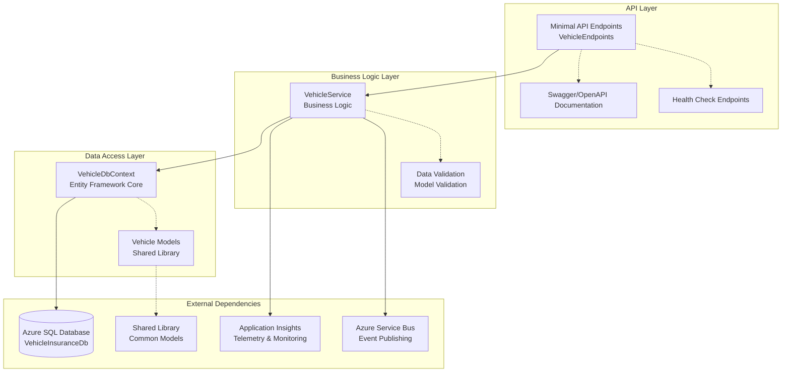
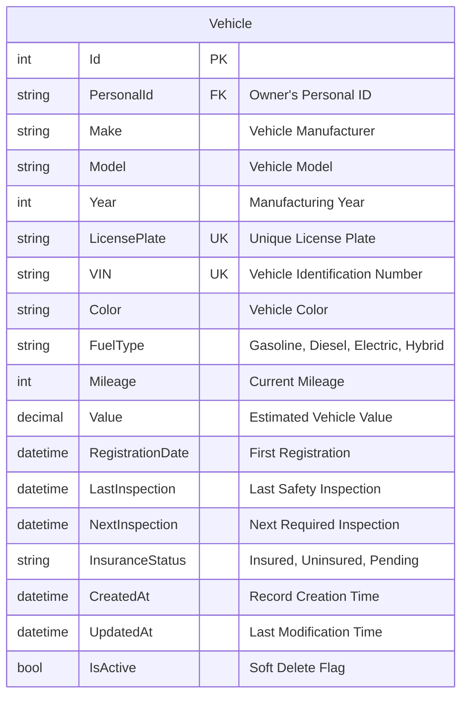

# Vehicle Insurance Service

A specialized microservice responsible for managing vehicle data and vehicle-specific insurance operations within the Insurance Management System.

## 🎯 Purpose

This service provides dedicated functionality for:

- Vehicle registration and management
- Vehicle-specific insurance data
- Vehicle information validation
- Integration with the main insurance orchestration system

## 🏗️ Service Architecture



## 📊 Database Schema



## Features

- **Vehicle CRUD Operations**: Create, Read, Update, Delete vehicles
- **Duplicate Detection**: Prevents duplicate VIN and license plate entries
- **Data Validation**: Comprehensive input validation with proper error responses
- **Application Insights Integration**: Full telemetry and logging support
- **Azure App Service Ready**: Optimized for Azure deployment
- **Unit Test Support**: In-memory database support for testing

## Technology Stack

- .NET 8 Web API
- Entity Framework Core 8.0
- SQL Server / In-Memory Database
- Application Insights
- Swagger/OpenAPI
- Minimal APIs

## Configuration

The service uses `appsettings.json` for configuration:

```json
{
  "APPLICATIONINSIGHTS_CONNECTION_STRING": "",
  "SqlConnectionString": "",
  "ServiceBusConnectionString": "",
  "StorageAccountConnectionString": "",
  "ServiceBusNamespace": "",
  "SvbusInvoiceGenQueueName": "invoice-generation-queue",
  "SvbusInvoiceEmailQueueName": "invoice-email-notification-queue",
  "InvoicesContainerName": "invoices"
}
```

### Configuration Priority

1. `SqlConnectionString` (primary configuration key)
2. In-Memory Database (development/testing when no connection string provided)

## API Endpoints

| Method | Endpoint         | Description             |
| ------ | ---------------- | ----------------------- |
| GET    | `/vehicles`      | Get all vehicles        |
| GET    | `/vehicles/{id}` | Get vehicle by ID       |
| POST   | `/vehicles`      | Create new vehicle      |
| PUT    | `/vehicles/{id}` | Update existing vehicle |
| DELETE | `/vehicles/{id}` | Delete vehicle          |

## Vehicle Model

```json
{
  "id": "guid",
  "licensePlate": "string (required)",
  "make": "string (required)",
  "model": "string (required)",
  "year": "integer (required)",
  "vin": "string (required)"
}
```

## Validation Rules

- **License Plate**: Required, must be unique
- **Make**: Required
- **Model**: Required
- **Year**: Required
- **VIN**: Required, must be unique

## Error Handling

The API returns appropriate HTTP status codes:

- `200 OK`: Successful operation
- `201 Created`: Vehicle created successfully
- `400 Bad Request`: Validation errors
- `404 Not Found`: Vehicle not found
- `409 Conflict`: Duplicate VIN or license plate
- `500 Internal Server Error`: Server errors

Error responses include detailed error messages:

```json
{
  "errors": ["Error message 1", "Error message 2"]
}
```

## Database Schema

The service creates the following database structure:

```sql
CREATE TABLE Vehicles (
  Id uniqueidentifier PRIMARY KEY,
  LicensePlate nvarchar(20) NOT NULL,
  Make nvarchar(50) NOT NULL,
  Model nvarchar(50) NOT NULL,
  Year int NOT NULL,
  Vin nvarchar(17) NOT NULL
);

CREATE UNIQUE INDEX IX_Vehicles_Vin ON Vehicles (Vin);
CREATE UNIQUE INDEX IX_Vehicles_LicensePlate ON Vehicles (LicensePlate);
```

## Development

### Running Locally

1. Configure connection string in `appsettings.json`
2. Run the application:
   ```bash
   dotnet run
   ```
3. Access Swagger UI: `http://localhost:52864/swagger` (default port)
4. Access API endpoints: `http://localhost:52864/vehicles`

### Testing

The service supports unit testing with in-memory database:

```bash
dotnet test
```

## Deployment

### Azure App Service

1. Set Application Insights connection string
2. Configure SQL Database connection string
3. Deploy using Azure DevOps, GitHub Actions, or Visual Studio

### Environment Variables

Required for Azure deployment:

- `APPLICATIONINSIGHTS_CONNECTION_STRING`
- `SqlConnectionString` or `ConnectionStrings__DefaultConnection`

## Performance Features

- **Connection Pooling**: Automatic EF Core connection pooling
- **Retry Logic**: Automatic retry on transient failures (5 retries, 30s max delay)
- **Optimized Queries**: Efficient database queries with proper indexing
- **Minimal APIs**: Lightweight endpoint routing

## Logging

The service logs the following events:

- Vehicle creation, updates, and deletions
- Database initialization status
- Error conditions with detailed context

Logs are automatically sent to Application Insights when configured.

## Security Considerations

- Input validation on all endpoints
- SQL injection protection via parameterized queries
- Error handling that doesn't expose sensitive information
- HTTPS enforced in production
