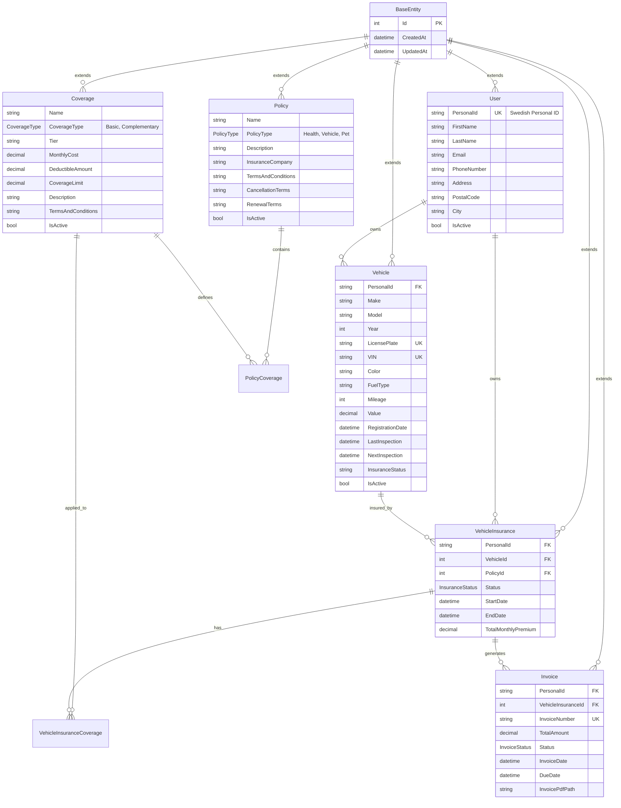

# Shared Library

A comprehensive shared library containing common models, services, and utilities used across all components of the Insurance Management System.

## 🎯 Purpose

This shared library provides:

- **Common Data Models**: Shared entities and data transfer objects
- **Repository Pattern**: Generic data access implementations
- **Service Extensions**: Azure service integrations
- **Configuration Management**: Centralized application configuration
- **Utility Classes**: Common functionality across services

## 🏗️ Library Architecture

```mermaid
graph TB
    subgraph "Shared Library Components"
        subgraph "Models"
            ENTITIES[Entity Models<br/>BaseEntity, User, Policy, etc.]
            MESSAGES[Message Models<br/>Service Bus DTOs]
            ENUMS[Enumerations<br/>PolicyType, InsuranceStatus]
        end

        subgraph "Repository"
            IREPO[IGenericRepository<br/>Interface]
            REPO[GenericRepository<br/>Implementation]
        end

        subgraph "Services"
            AI_SVC[ApplicationInsightsService<br/>Telemetry Wrapper]
            SB_SVC[ServiceBusMessagingService<br/>Message Queue]
        end

        subgraph "Extensions"
            SVC_EXT[ServiceCollectionExtensions<br/>DI Configuration]
        end

        subgraph "Configuration"
            APP_CONFIG[AppConfig<br/>Settings Management]
        end
    end

    subgraph "Consumer Projects"
        INS_SVC[Insurance Management Service]
        VEH_SVC[Vehicle Insurance Service]
        BILL_FUNC[Billing Service Function]
        NOTIFY_FUNC[Notification Service Function]
    end

    ENTITIES --> INS_SVC
    ENTITIES --> VEH_SVC
    ENTITIES --> BILL_FUNC
    ENTITIES --> NOTIFY_FUNC

    REPO --> INS_SVC
    REPO --> VEH_SVC
    REPO --> BILL_FUNC

    AI_SVC --> INS_SVC
    AI_SVC --> VEH_SVC
    AI_SVC --> BILL_FUNC
    AI_SVC --> NOTIFY_FUNC

    SB_SVC --> INS_SVC
    SB_SVC --> VEH_SVC
    SB_SVC --> BILL_FUNC

    SVC_EXT --> INS_SVC
    SVC_EXT --> VEH_SVC
    SVC_EXT --> BILL_FUNC
    SVC_EXT --> NOTIFY_FUNC
```



## 📊 Data Models

### Core Entity Models



## 🔧 Technical Stack

### Core Technologies

- **.NET 8**: Target framework
- **Entity Framework Core 8.0.6**: ORM and data access
- **System.ComponentModel.Annotations**: Data validation
- **Microsoft.Extensions**: Dependency injection and configuration

### Key Dependencies

```xml
<PackageReference Include="Microsoft.EntityFrameworkCore" Version="8.0.6" />
<PackageReference Include="Microsoft.EntityFrameworkCore.SqlServer" Version="8.0.6" />
<PackageReference Include="Microsoft.ApplicationInsights" Version="2.22.0" />
<PackageReference Include="Azure.Identity" Version="1.14.0" />
<PackageReference Include="Azure.Messaging.ServiceBus" Version="7.18.1" />
<PackageReference Include="Microsoft.Extensions.Configuration.Abstractions" Version="8.0.0" />
<PackageReference Include="Microsoft.Extensions.Logging.Abstractions" Version="8.0.3" />
```

### Azure Integrations

- **Azure Service Bus**: Message queuing and communication
- **Application Insights**: Telemetry and monitoring
- **Azure Identity**: Authentication and authorization

## 📋 Core Models

### BaseEntity

```csharp
public abstract class BaseEntity
{
    [Key]
    public int Id { get; set; }

    [Required]
    public DateTime CreatedAt { get; set; } = DateTime.UtcNow;

    [Required]
    public DateTime UpdatedAt { get; set; } = DateTime.UtcNow;
}
```

### User Model

```csharp
public class User : BaseEntity
{
    [Required]
    [MaxLength(12)]
    [Index(IsUnique = true)]
    public string PersonalId { get; set; } = string.Empty; // Swedish Personal ID

    [Required]
    [MaxLength(100)]
    public string FirstName { get; set; } = string.Empty;

    [Required]
    [MaxLength(100)]
    public string LastName { get; set; } = string.Empty;

    [Required]
    [EmailAddress]
    [MaxLength(200)]
    public string Email { get; set; } = string.Empty;

    [Phone]
    [MaxLength(20)]
    public string PhoneNumber { get; set; } = string.Empty;

    [Required]
    public bool IsActive { get; set; } = true;

    // Navigation properties
    public virtual ICollection<VehicleInsurance> VehicleInsurances { get; set; } = new List<VehicleInsurance>();
    public virtual ICollection<Vehicle> Vehicles { get; set; } = new List<Vehicle>();
}
```

### Policy Model

```csharp
public enum PolicyType
{
    Health = 1,
    Vehicle = 2,
    Pet = 3
}

public class Policy : BaseEntity
{
    [Required]
    [MaxLength(200)]
    public string Name { get; set; } = string.Empty;

    [Required]
    public PolicyType PolicyType { get; set; }

    [MaxLength(1000)]
    public string Description { get; set; } = string.Empty;

    [Required]
    [MaxLength(200)]
    public string InsuranceCompany { get; set; } = string.Empty;

    [Required]
    public bool IsActive { get; set; } = true;

    // Navigation properties
    public virtual ICollection<PolicyCoverage> PolicyCoverages { get; set; } = new List<PolicyCoverage>();
}
```

### Coverage Model

```csharp
public enum CoverageType
{
    Basic = 1,
    Complementary = 2
}

public class Coverage : BaseEntity
{
    [Required]
    [MaxLength(200)]
    public string Name { get; set; } = string.Empty;

    [Required]
    public CoverageType CoverageType { get; set; }

    [Required]
    [Range(0, double.MaxValue)]
    public decimal MonthlyCost { get; set; }

    [Required]
    [Range(0, double.MaxValue)]
    public decimal DeductibleAmount { get; set; }

    [Required]
    [Range(0, double.MaxValue)]
    public decimal CoverageLimit { get; set; }

    [Required]
    public bool IsActive { get; set; } = true;
}
```

## 📨 Message Models

### InvoiceGenerationMessage

```csharp
public class InvoiceGenerationMessage
{
    [Required]
    public Guid VehicleInsuranceId { get; set; }

    [Required]
    [RegularExpression(@"^\d{10,12}$")]
    public string PersonalId { get; set; } = string.Empty;

    public string RequestedBy { get; set; } = "system";

    public string Priority { get; set; } = "normal";

    public DateTime RequestedDate { get; set; } = DateTime.UtcNow;
}
```

### EmailInvoiceNotificationMessage

```csharp
public class EmailInvoiceNotificationMessage
{
    [Required]
    public string MessageType { get; set; } = "EmailInvoiceNotification";

    [Required]
    [EmailAddress]
    public string RecipientEmail { get; set; } = string.Empty;

    [Required]
    [MaxLength(200)]
    public string RecipientName { get; set; } = string.Empty;

    [Required]
    public string PersonalId { get; set; } = string.Empty;

    [Required]
    public Guid InvoiceId { get; set; }

    [Required]
    public string InvoiceNumber { get; set; } = string.Empty;

    [Required]
    [Range(0, double.MaxValue)]
    public decimal TotalAmount { get; set; }

    [Required]
    public DateTime DueDate { get; set; }

    public string InvoicePdfPath { get; set; } = string.Empty;

    [Required]
    public string EmailTemplate { get; set; } = string.Empty;
}
```

## 🗂️ Repository Pattern

### IGenericRepository Interface

```csharp
public interface IGenericRepository<T> where T : BaseEntity
{
    Task<T?> GetByIdAsync(int id);
    Task<T?> GetByIdAsync(Guid id);
    Task<IEnumerable<T>> GetAllAsync();
    Task<IEnumerable<T>> FindAsync(Expression<Func<T, bool>> predicate);
    Task<T> AddAsync(T entity);
    Task<T> UpdateAsync(T entity);
    Task DeleteAsync(int id);
    Task DeleteAsync(Guid id);
    Task<bool> ExistsAsync(int id);
    Task<bool> ExistsAsync(Guid id);
    Task<int> SaveChangesAsync();
}
```

### GenericRepository Implementation

```csharp
public class GenericRepository<T> : IGenericRepository<T> where T : BaseEntity
{
    protected readonly DbContext _context;
    protected readonly DbSet<T> _dbSet;
    protected readonly ILogger<GenericRepository<T>> _logger;

    public GenericRepository(DbContext context, ILogger<GenericRepository<T>> logger)
    {
        _context = context;
        _dbSet = context.Set<T>();
        _logger = logger;
    }

    public virtual async Task<T?> GetByIdAsync(int id)
    {
        return await _dbSet.FindAsync(id);
    }

    public virtual async Task<IEnumerable<T>> GetAllAsync()
    {
        return await _dbSet.ToListAsync();
    }

    public virtual async Task<T> AddAsync(T entity)
    {
        entity.CreatedAt = DateTime.UtcNow;
        entity.UpdatedAt = DateTime.UtcNow;

        await _dbSet.AddAsync(entity);
        return entity;
    }
}
```

## 🛠️ Services

### ApplicationInsightsService

```csharp
public class ApplicationInsightsService
{
    private readonly TelemetryClient _telemetryClient;
    private readonly ILogger<ApplicationInsightsService> _logger;

    public ApplicationInsightsService(TelemetryClient telemetryClient, ILogger<ApplicationInsightsService> logger)
    {
        _telemetryClient = telemetryClient;
        _logger = logger;
    }

    public void TrackBusinessEvent(string eventName, Dictionary<string, string> properties)
    {
        _telemetryClient.TrackEvent(eventName, properties);
        _logger.LogInformation("Business event tracked: {EventName}", eventName);
    }

    public async Task<T> TrackOperationAsync<T>(string operationName, Func<Task<T>> operation, Dictionary<string, string>? properties = null)
    {
        using var operation = _telemetryClient.StartOperation<DependencyTelemetry>(operationName);

        try
        {
            var result = await operation();
            operation.Telemetry.Success = true;
            return result;
        }
        catch (Exception ex)
        {
            operation.Telemetry.Success = false;
            _telemetryClient.TrackException(ex, properties);
            throw;
        }
    }
}
```

### ServiceBusMessagingService

```csharp
public interface IServiceBusMessagingService
{
    Task SendMessageAsync<T>(string queueName, T message) where T : class;
    Task SendMessagesAsync<T>(string queueName, IEnumerable<T> messages) where T : class;
}

public class ServiceBusMessagingService : IServiceBusMessagingService
{
    private readonly ServiceBusClient _serviceBusClient;
    private readonly ILogger<ServiceBusMessagingService> _logger;

    public ServiceBusMessagingService(string connectionString, ILogger<ServiceBusMessagingService> logger)
    {
        _serviceBusClient = new ServiceBusClient(connectionString);
        _logger = logger;
    }

    public async Task SendMessageAsync<T>(string queueName, T message) where T : class
    {
        var sender = _serviceBusClient.CreateSender(queueName);
        var messageBody = JsonSerializer.Serialize(message);
        var serviceBusMessage = new ServiceBusMessage(messageBody);

        await sender.SendMessageAsync(serviceBusMessage);
        _logger.LogInformation("Message sent to queue {QueueName}: {MessageType}", queueName, typeof(T).Name);
    }
}
```

## ⚙️ Configuration Management

### AppConfig

```csharp
public class AppConfig
{
    public string SqlConnectionString { get; set; } = string.Empty;
    public string ServiceBusConnectionString { get; set; } = string.Empty;
    public string StorageAccountConnectionString { get; set; } = string.Empty;
    public string ApplicationInsightsConnectionString { get; set; } = string.Empty;
    public string KeyVaultEndpoint { get; set; } = string.Empty;

    // Service Bus Queue Names
    public string SvbusInvoiceGenQueueName { get; set; } = "invoice-generation-queue";
    public string SvbusInvoiceEmailQueueName { get; set; } = "email-notification-queue";
    public string SvbusSmsQueueName { get; set; } = "sms-notification-queue";
    public string SvbusSystemAlertQueueName { get; set; } = "system-alert-queue";

    // Storage Configuration
    public string InvoiceContainer { get; set; } = "invoices";
    public string DocumentContainer { get; set; } = "documents";
    public string TemplateContainer { get; set; } = "templates";
}
```

## 🔧 Service Extensions

### ServiceCollectionExtensions

```csharp
public static class ServiceCollectionExtensions
{
    public static IServiceCollection AddApplicationInsightsService(
        this IServiceCollection services,
        IConfiguration configuration)
    {
        var connectionString = configuration["ApplicationInsightsConnectionString"];

        if (!string.IsNullOrEmpty(connectionString))
        {
            services.AddApplicationInsightsTelemetry(options =>
            {
                options.ConnectionString = connectionString;
            });

            services.AddScoped<ApplicationInsightsService>();
        }

        return services;
    }

    public static IServiceCollection AddServiceBusMessaging(
        this IServiceCollection services)
    {
        services.AddScoped<IServiceBusMessagingService>(provider =>
        {
            var configuration = provider.GetRequiredService<IConfiguration>();
            var connectionString = configuration["ServiceBusConnectionString"];
            var logger = provider.GetRequiredService<ILogger<ServiceBusMessagingService>>();

            return new ServiceBusMessagingService(connectionString, logger);
        });

        return services;
    }

    public static IServiceCollection AddGenericRepository<TEntity, TContext>(
        this IServiceCollection services)
        where TEntity : BaseEntity
        where TContext : DbContext
    {
        services.AddScoped<IGenericRepository<TEntity>>(provider =>
        {
            var context = provider.GetRequiredService<TContext>();
            var logger = provider.GetRequiredService<ILogger<GenericRepository<TEntity>>>();
            return new GenericRepository<TEntity>(context, logger);
        });

        return services;
    }
}
```

## 🔍 Validation Attributes

### Custom Validation

```csharp
public class SwedishPersonalIdAttribute : ValidationAttribute
{
    public override bool IsValid(object? value)
    {
        if (value is not string personalId)
            return false;

        // Swedish Personal ID validation logic
        return personalId.Length >= 10 && personalId.Length <= 12 &&
               personalId.All(char.IsDigit);
    }
}

public class VINAttribute : ValidationAttribute
{
    public override bool IsValid(object? value)
    {
        if (value is not string vin)
            return false;

        // VIN validation logic
        return vin.Length == 17 &&
               vin.All(c => char.IsLetterOrDigit(c)) &&
               !vin.Any(c => "IOQ".Contains(c));
    }
}
```

## 🧪 Testing Support

### Test Utilities

```csharp
public static class TestDataFactory
{
    public static User CreateTestUser(string personalId = "196001011234")
    {
        return new User
        {
            PersonalId = personalId,
            FirstName = "Test",
            LastName = "User",
            Email = "test@example.com",
            PhoneNumber = "+46701234567",
            Address = "Test Street 123",
            PostalCode = "12345",
            City = "Test City"
        };
    }

    public static Vehicle CreateTestVehicle(string personalId = "196001011234")
    {
        return new Vehicle
        {
            PersonalId = personalId,
            Make = "Volvo",
            Model = "XC90",
            Year = 2023,
            LicensePlate = "ABC123",
            VIN = "YV1DZ8256A1234567",
            Color = "Black",
            FuelType = "Hybrid",
            Mileage = 15000,
            Value = 650000m
        };
    }
}
```

## 📈 Performance Considerations

### Entity Framework Optimizations

```csharp
// Optimized query patterns
public async Task<IEnumerable<VehicleInsurance>> GetActiveInsurancesAsync()
{
    return await _context.VehicleInsurances
        .AsNoTracking()
        .Where(vi => vi.Status == InsuranceStatus.Active)
        .Include(vi => vi.Vehicle)
        .Include(vi => vi.Policy)
        .ToListAsync();
}

// Bulk operations
public async Task<int> BulkUpdateInsuranceStatusAsync(IEnumerable<int> insuranceIds, InsuranceStatus status)
{
    return await _context.VehicleInsurances
        .Where(vi => insuranceIds.Contains(vi.Id))
        .ExecuteUpdateAsync(setters => setters
            .SetProperty(vi => vi.Status, status)
            .SetProperty(vi => vi.UpdatedAt, DateTime.UtcNow));
}
```

### Caching Support

```csharp
public interface ICacheService
{
    Task<T?> GetAsync<T>(string key);
    Task SetAsync<T>(string key, T value, TimeSpan? expiration = null);
    Task RemoveAsync(string key);
}

// Usage in repositories
public async Task<Policy?> GetPolicyByIdAsync(int id)
{
    var cacheKey = $"policy_{id}";
    var cachedPolicy = await _cacheService.GetAsync<Policy>(cacheKey);

    if (cachedPolicy != null)
        return cachedPolicy;

    var policy = await _dbSet.FindAsync(id);
    if (policy != null)
        await _cacheService.SetAsync(cacheKey, policy, TimeSpan.FromMinutes(30));

    return policy;
}
```

## 🔐 Security Features

### Data Protection

```csharp
public static class DataProtectionExtensions
{
    public static string MaskPersonalId(this string personalId)
    {
        if (string.IsNullOrEmpty(personalId) || personalId.Length < 6)
            return "****";

        return personalId.Substring(0, 2) + "****" + personalId.Substring(personalId.Length - 2);
    }

    public static string MaskEmail(this string email)
    {
        if (string.IsNullOrEmpty(email) || !email.Contains('@'))
            return "****";

        var parts = email.Split('@');
        var localPart = parts[0];
        var domain = parts[1];

        var maskedLocal = localPart.Length > 2
            ? localPart.Substring(0, 2) + "****"
            : "****";

        return maskedLocal + "@" + domain;
    }
}
```

### Audit Logging

```csharp
public interface IAuditService
{
    Task LogEntityChangeAsync<T>(T entity, string operation, string userId) where T : BaseEntity;
    Task LogBusinessEventAsync(string eventName, string details, string userId);
}

public class AuditService : IAuditService
{
    private readonly ApplicationInsightsService _appInsights;

    public async Task LogEntityChangeAsync<T>(T entity, string operation, string userId) where T : BaseEntity
    {
        var properties = new Dictionary<string, string>
        {
            ["EntityType"] = typeof(T).Name,
            ["EntityId"] = entity.Id.ToString(),
            ["Operation"] = operation,
            ["UserId"] = userId,
            ["Timestamp"] = DateTime.UtcNow.ToString("O")
        };

        _appInsights.TrackBusinessEvent("EntityChanged", properties);
    }
}
```

## 📚 Usage Examples

### Service Registration

```csharp
// In Program.cs of consuming services
builder.Services.AddApplicationInsightsService(builder.Configuration);
builder.Services.AddServiceBusMessaging();
builder.Services.AddGenericRepository<User, InsuranceManagementDbContext>();
builder.Services.AddGenericRepository<Vehicle, VehicleDbContext>();
```

### Repository Usage

```csharp
public class InsuranceService
{
    private readonly IGenericRepository<VehicleInsurance> _insuranceRepository;
    private readonly IGenericRepository<User> _userRepository;

    public async Task<VehicleInsurance> CreateInsuranceAsync(CreateInsuranceRequest request)
    {
        var user = await _userRepository.FindAsync(u => u.PersonalId == request.PersonalId);

        var insurance = new VehicleInsurance
        {
            PersonalId = request.PersonalId,
            VehicleId = request.VehicleId,
            PolicyId = request.PolicyId,
            StartDate = request.StartDate,
            Status = InsuranceStatus.Active
        };

        return await _insuranceRepository.AddAsync(insurance);
    }
}
```

### Service Bus Messaging

```csharp
public class BillingService
{
    private readonly IServiceBusMessagingService _messagingService;

    public async Task GenerateInvoiceAsync(VehicleInsurance insurance)
    {
        var message = new InvoiceGenerationMessage
        {
            VehicleInsuranceId = insurance.Id,
            PersonalId = insurance.PersonalId,
            RequestedBy = "system"
        };

        await _messagingService.SendMessageAsync("invoice-generation-queue", message);
    }
}
```

---

## 📞 Support Information

- **Target Framework**: .NET 8
- **Package Type**: Class Library
- **Consumers**: All services and functions in the solution
- **Key Features**: Entity models, repository pattern, Azure service integrations
- **Repository**: `shared/`
